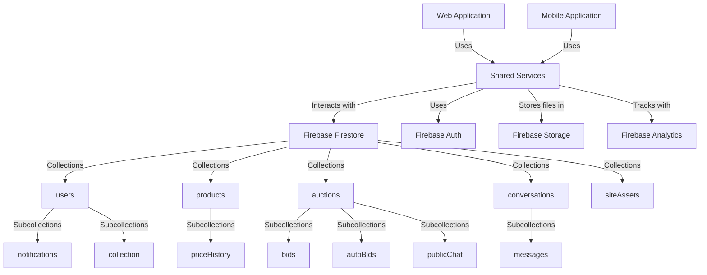

# eNumismatica.ro Platform - Architectural Analysis Report

## Executive Summary

The eNumismatica.ro platform is a comprehensive numismatics marketplace built as a cross-platform application with web and mobile interfaces. The system leverages Firebase as its backend infrastructure and follows a modern, modular architecture with clear separation of concerns.

## 1. Current File Organization and Module Structure

### Project Structure Overview

```
.
├── mobile/                  # Mobile application (React Native/Expo)
├── shared/                  # Shared business logic and services
├── web/                     # Web application (Next.js)
├── monede/                  # Coin image assets
└── *.md                     # Documentation files
```

### Key Directories Analysis

#### Shared Module (`shared/`)
The shared module contains the core business logic and services that are used by both web and mobile applications:

- **Services**: Comprehensive service layer for all business operations
  - `auth.ts` - Authentication services
  - `auctionService.ts` - Auction management and bidding logic
  - `adminService.ts` - Admin-specific operations
  - `collectionService.ts` - User collection management
  - `chatService.ts` - Chat and messaging functionality
  - `creditService.ts` - Credit and referral system
  - `priceHistoryService.ts` - Price tracking and history
  - `activityLogService.ts` - Activity logging and monitoring

- **Core Infrastructure**:
  - `firebaseConfig.ts` - Firebase initialization and configuration
  - `types.ts` - TypeScript interfaces for all data models

- **Utilities**:
  - `utils/currency.ts` - Currency formatting utilities

#### Web Module (`web/`)
The web application is built with Next.js and follows a modern React architecture:

- **App Structure**: Uses Next.js App Router with route groups
  - `app/page.tsx` - Main landing page
  - `app/about/` - About page
  - `app/auctions/` - Auction browsing and details
  - `app/products/` - Product catalog
  - `app/admin/` - Admin dashboard and management
  - `app/dashboard/` - User dashboard
  - `app/login/` - Authentication pages

- **Components**: Reusable UI components
  - `components/Navigation.tsx` - Main navigation
  - `components/AuctionCard.tsx` - Auction display component
  - `components/ProductCard.tsx` - Product display component
  - `components/NotificationCenter.tsx` - Notification system
  - `components/PriceEvolutionChart.tsx` - Price history visualization

- **Context**: React context providers
  - `context/AuthContext.tsx` - Authentication state management

- **Hooks**: Custom React hooks
  - `hooks/useAuctions.ts` - Auction data fetching
  - `hooks/useBids.ts` - Bidding functionality
  - `hooks/useChat.ts` - Chat management
  - `hooks/useCollection.ts` - User collection management

#### Mobile Module (`mobile/`)
The mobile application uses React Native with Expo:

- **Navigation**: Stack and tab navigation
  - `App.tsx` - Main app entry with navigation setup
  - `navigationTypes.ts` - Type definitions for navigation

- **Screens**: Mobile-specific UI screens
  - `screens/AuctionListScreen.tsx` - Auction browsing
  - `screens/ProductCatalogScreen.tsx` - Product catalog
  - `screens/DashboardScreen.tsx` - User dashboard
  - `screens/LoginScreen.tsx` - Authentication

- **Context**: Mobile-specific context
  - `context/AuthContext.tsx` - Mobile authentication state

- **Services**: Mobile-specific services
  - `services/notificationService.ts` - Push notification handling

## 2. Existing Services and Their Responsibilities

### Authentication Service (`shared/auth.ts`)
- **Responsibilities**:
  - User registration and login (email/password, Google OAuth)
  - Session management
  - Role-based access control
  - Referral code handling
  - Activity logging for authentication events

- **Key Functions**:
  - `signInWithEmail()` - Email/password authentication
  - `signUpWithEmail()` - User registration with referral support
  - `signInWithGoogle()` - Google OAuth authentication
  - `logout()` - Session termination
  - `onAuthStateChange()` - Authentication state monitoring

### Auction Service (`shared/auctionService.ts`)
- **Responsibilities**:
  - Auction lifecycle management
  - Bid validation and processing
  - Auto-bidding system
  - Auction status management
  - Price history tracking
  - Notification generation

- **Key Functions**:
  - `placeBid()` - Bid placement with validation
  - `setAutoBid()` - Auto-bid configuration
  - `endAuction()` - Auction completion processing
  - `validateBid()` - Business rule validation
  - `processAutoBidsInTransaction()` - Auto-bid processing logic

### Admin Service (`shared/adminService.ts`)
- **Responsibilities**:
  - User management (CRUD operations)
  - Product and auction moderation
  - Platform analytics and statistics
  - Admin role management
  - Content approval workflows
  - User analytics and monitoring

- **Key Functions**:
  - `isAdmin()` - Role verification
  - `getAllUsers()` - User management
  - `approveProduct()`/`rejectProduct()` - Content moderation
  - `getPlatformStats()` - Platform analytics
  - `getUserAnalytics()` - User-specific analytics
  - `deleteUser()` - User account management

### Collection Service (`shared/collectionService.ts`)
- **Responsibilities**:
  - Personal coin collection management
  - Collection item CRUD operations
  - Collection valuation and tracking
  - User inventory organization

### Chat Service (`shared/chatService.ts`)
- **Responsibilities**:
  - Real-time messaging between users
  - Auction public chat
  - Private buyer-seller conversations
  - Message history and retrieval
  - Typing indicators and read receipts

## 3. Current User and Admin Functionality

### User Functionality

#### Authentication & Profile
- Email/password and Google OAuth login
- User registration with referral system
- Profile management
- Credit and referral tracking

#### Browsing & Discovery
- Product catalog browsing with filters
- Auction browsing and search
- Price history visualization
- Collection viewing

#### Trading & Bidding
- Product listing creation
- Auction participation and bidding
- Auto-bidding system
- Real-time auction monitoring
- Bid validation and processing

#### Communication
- Public auction chat (anonymous during bidding)
- Private buyer-seller messaging
- Conversation management
- Message notifications

#### Collection Management
- Personal coin collection tracking
- Collection item organization
- Valuation and price tracking
- Acquisition history

### Admin Functionality

#### User Management
- User account administration
- Role assignment (admin/user)
- User analytics dashboard
- Account deletion and suspension

#### Content Moderation
- Product approval/rejection workflow
- Auction approval/rejection workflow
- Content status management
- Moderation history tracking

#### Platform Monitoring
- Real-time activity monitoring
- Suspicious activity detection
- Error tracking and logging
- System health monitoring

#### Analytics & Reporting
- Platform statistics dashboard
- User behavior analytics
- Sales and auction performance
- Collection valuation reports

#### Support & Communication
- Admin-initiated user support chats
- Conversation monitoring
- Message history access
- Support conversation management

## 4. Shared Components and Utilities

### Core Shared Components

#### Authentication System
- Unified auth state management across platforms
- Role-based access control
- Session persistence
- Cross-platform authentication flow

#### Data Models (`shared/types.ts`)
Comprehensive TypeScript interfaces for:
- Users with roles and credits
- Products with numismatic metadata
- Auctions with bidding history
- Collection items with valuation
- Chat messages and conversations
- Activity logs and notifications

#### Firebase Integration
- Unified Firebase configuration
- Firestore database schema
- Real-time data synchronization
- Cloud Storage integration
- Analytics and performance monitoring

### Utility Functions

#### Currency Utilities (`shared/utils/currency.ts`)
- Currency formatting
- Price display formatting
- Numerical value processing

#### Activity Logging (`shared/activityLogService.ts`)
- Comprehensive activity tracking
- Real-time activity monitoring
- Suspicious activity detection
- Admin activity auditing

#### Notification System
- Real-time notification delivery
- Push notification integration
- Notification categorization
- Read status tracking

## 5. Database and API Integration Patterns

### Database Architecture

#### Firestore Collections Structure
```
- users: User documents
  - notifications: ChatNotification subcollection
  - collection: CollectionItem subcollection (personal coin collection)
- products: Product documents
  - priceHistory: PriceHistory subcollection (price evolution tracking)
- auctions: Auction documents
  - bids: Bid subcollection under each auction
  - autoBids: AutoBid subcollection under each auction
  - publicChat: ChatMessage subcollection for public auction chat
  - priceHistory: PriceHistory subcollection (bid price evolution)
- conversations: Conversation documents (private buyer-seller chats)
  - messages: ChatMessage subcollection under each conversation
- siteAssets: SiteAsset documents for static assets
- eventRegistrations: EventRegistration documents for QR/event registrations
```

### API Integration Patterns

#### Service Layer Architecture
- **Unified Service Interface**: All business logic is encapsulated in shared services
- **Platform-Agnostic Design**: Services work identically across web and mobile
- **Transaction Support**: Complex operations use Firestore transactions
- **Error Handling**: Comprehensive error handling and logging
- **Real-time Updates**: Leverages Firestore real-time listeners

#### Data Access Patterns
- **Repository Pattern**: Service functions abstract database operations
- **Query Building**: Dynamic query construction based on parameters
- **Data Transformation**: Automatic timestamp conversion and data normalization
- **Batch Operations**: Support for bulk data operations

#### Notification Patterns
- **Event-Driven Architecture**: Actions trigger appropriate notifications
- **Multi-Channel Delivery**: In-app, push, and email notifications
- **Context-Aware Messaging**: Notifications tailored to user context
- **Read Tracking**: Comprehensive notification status management

### Cross-Platform Integration

#### Shared State Management
- **Unified Authentication**: Single auth system across platforms
- **Consistent Data Models**: Identical data structures everywhere
- **Synchronized Business Logic**: Same rules apply universally
- **Platform-Specific Adaptations**: UI adaptations with identical core logic

#### API Consumption Patterns
- **Service Import Pattern**: Both platforms import from shared module
- **Identical Function Signatures**: Same function calls work everywhere
- **Consistent Error Handling**: Uniform error responses
- **Unified Analytics**: Same tracking across all platforms

## 6. Technical Architecture Diagram



## 7. Key Architectural Strengths

### Modular Design
- Clear separation between shared business logic and platform-specific UI
- Well-defined service boundaries with single responsibilities
- Easy to extend or replace individual components

### Cross-Platform Consistency
- Identical business rules across all platforms
- Unified authentication and data models
- Consistent API surface area

### Comprehensive Data Model
- Rich numismatic metadata support
- Complete auction and bidding system
- Detailed user collection tracking
- Comprehensive activity logging

### Robust Admin System
- Full-featured administration interface
- Comprehensive monitoring and analytics
- Content moderation workflows
- User support capabilities

### Real-time Capabilities
- Live auction monitoring
- Real-time chat functionality
- Instant notification delivery
- Activity feed updates

## 8. Potential Areas for Improvement

### Performance Optimization
- **Data Loading**: Some admin pages load all data at once
- **Query Optimization**: Some queries could benefit from better indexing
- **Caching Strategy**: More aggressive caching for frequently accessed data

### Error Handling
- **User Feedback**: Some error cases could provide better user guidance
- **Recovery Patterns**: Additional retry logic for transient failures
- **Graceful Degradation**: Better fallback UIs for offline scenarios

### Security Enhancements
- **Input Validation**: Additional validation layers
- **Rate Limiting**: Protection against abusive API usage
- **Audit Logging**: More comprehensive security event tracking

### Mobile-Specific Optimizations
- **Offline Support**: Enhanced offline functionality
- **Background Sync**: Better background data synchronization
- **Push Notifications**: More sophisticated push notification handling

## 9. Implementation Strategy Recommendations

### For New Feature Development

1. **Service-First Approach**: Always implement core logic in shared services
2. **Platform-Specific UI**: Build platform-optimized interfaces that consume shared services
3. **Consistent Data Models**: Extend existing TypeScript interfaces rather than creating new ones
4. **Leverage Existing Patterns**: Follow established patterns for notifications, logging, and error handling

### For Performance Improvements

1. **Implement Pagination**: Add pagination to data-heavy admin interfaces
2. **Enhance Caching**: Implement more sophisticated caching strategies
3. **Optimize Queries**: Review and optimize Firestore queries
4. **Add Loading States**: Improve user feedback during data operations

### For Security Enhancements

1. **Enhanced Validation**: Add comprehensive input validation
2. **Rate Limiting**: Implement API rate limiting
3. **Security Auditing**: Add comprehensive security event logging
4. **Permission Review**: Conduct thorough permission audit

## 10. Conclusion

The eNumismatica.ro platform demonstrates a well-architected, cross-platform numismatics marketplace with:

- **Strong Foundation**: Solid architectural principles and clear separation of concerns
- **Comprehensive Features**: Complete set of features for both users and administrators
- **Scalable Design**: Modular structure that supports growth and extension
- **Cross-Platform Excellence**: Consistent experience across web and mobile

The architecture provides an excellent foundation for implementing new features while maintaining the platform's integrity and user experience. The shared services layer ensures consistency across platforms, and the comprehensive admin system provides robust operational control.

Future development should focus on leveraging the existing architectural strengths while addressing the identified areas for improvement, particularly around performance optimization and enhanced security measures.