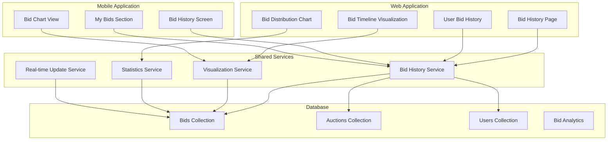
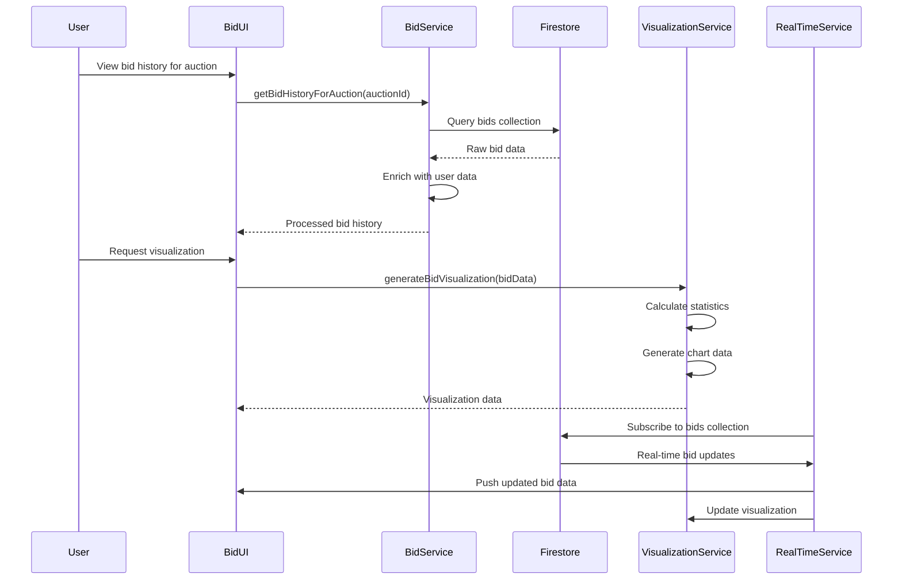

# Bid History Visualization Documentation

## Table of Contents

1. [Feature Overview](#feature-overview)
2. [Technical Architecture](#technical-architecture)
3. [API Documentation](#api-documentation)
4. [Database Schema](#database-schema)
5. [User Guide](#user-guide)
6. [Admin Guide](#admin-guide)
7. [Integration Points](#integration-points)
8. [Troubleshooting](#troubleshooting)
9. [Security Considerations](#security-considerations)
10. [Performance Optimization](#performance-optimization)

## Feature Overview

### Purpose

The Bid History Visualization feature provides interactive tracking and visualization of auction bid history. It enables users to analyze bidding patterns, track their own bidding activity, and gain insights into auction dynamics.

### Key Features

- **Real-time Bid Tracking**: Live updates as new bids are placed
- **Historical Bid Analysis**: Complete bid history for any auction
- **Interactive Visualizations**: Charts and graphs of bidding patterns
- **Bid Statistics**: Calculated metrics and trends
- **User Bid Highlighting**: Special marking of user's own bids
- **Cross-Auction Analysis**: Compare bidding across multiple auctions

### Business Value

- **Increased Transparency**: Users can see complete bidding history
- **Better Decision Making**: Data-driven bidding strategies
- **Enhanced Engagement**: Interactive features keep users involved
- **Fraud Detection**: Pattern analysis helps identify suspicious bidding
- **Market Insights**: Understanding of bidding trends and behaviors

## Technical Architecture

### Component Diagram



### Data Flow



### Service Implementation

The bid history service is implemented in `shared/bidHistoryService.ts` with comprehensive functionality:

```typescript
// Bid history retrieval
export async function getBidHistoryForAuction(
  auctionId: string,
  options?: {
    limit?: number;
    page?: number;
    includeUserData?: boolean;
  }
): Promise<{
  success: boolean;
  error?: string;
  bids?: BidHistory[];
  stats?: BidHistoryStats;
}>

// Paginated bid history
export async function getPaginatedBidHistory(
  auctionId: string,
  page: number,
  pageSize: number
): Promise<{
  success: boolean;
  error?: string;
  bids?: BidHistory[];
  totalBids?: number;
  totalPages?: number;
}>

// User-specific bid history
export async function getUserBidHistory(
  userId: string,
  options?: {
    limit?: number;
    includeAuctionData?: boolean;
  }
): Promise<{
  success: boolean;
  error?: string;
  bids?: UserBidHistory[];
}>

// Bid statistics and trends
export function calculateBidStats(bids: BidHistory[]): BidHistoryStats

// Real-time bid updates
export function subscribeToBidHistory(
  auctionId: string,
  callback: (bids: BidHistory[]) => void
): () => void
```

## API Documentation

### Base Endpoints

All bid history API endpoints are prefixed with `/api/bid-history/`

### Authentication

Most endpoints are publicly accessible. User-specific endpoints require authentication.

### Endpoints

#### GET /api/bid-history

**Description**: Get bid history for a specific auction

**Parameters**:
- `auctionId` (required): Auction ID to get bids for
- `limit` (optional): Maximum number of bids to return
- `page` (optional): Page number for pagination
- `includeUserData` (optional): Include user information (requires authentication)

**Response**:
```json
{
  "success": true,
  "bids": [
    {
      "id": "bid_id",
      "auctionId": "auction_123",
      "userId": "user_456",
      "amount": 150.00,
      "timestamp": "2023-12-01T10:30:00Z",
      "autoBid": false,
      "processed": true,
      "userName": "John Doe",
      "userAvatar": "https://.../avatar.jpg",
      "bidPosition": 1,
      "timeSincePreviousBid": 35
    }
  ],
  "stats": {
    "totalBids": 42,
    "highestBid": 250.00,
    "lowestBid": 100.00,
    "averageBid": 185.50,
    "bidFrequency": 0.75,
    "bidVelocity": 1.2,
    "competitionScore": 0.88
  }
}
```

#### GET /api/bid-history/user

**Description**: Get bid history for the current user

**Parameters**:
- `limit` (optional): Maximum number of bids to return
- `includeAuctionData` (optional): Include auction information

**Response**:
```json
{
  "success": true,
  "bids": [
    {
      "id": "bid_id",
      "auctionId": "auction_123",
      "amount": 150.00,
      "timestamp": "2023-12-01T10:30:00Z",
      "auctionTitle": "Rare Coin Collection",
      "auctionStatus": "active",
      "auctionEndTime": "2023-12-05T15:00:00Z",
      "wasWinningBid": true,
      "currentHighestBid": 200.00
    }
  ],
  "stats": {
    "totalBids": 12,
    "winRate": 0.42,
    "averageBidAmount": 175.50,
    "favoriteCategories": ["coins", "medals"]
  }
}
```

#### GET /api/bid-history/trends

**Description**: Get bidding trends and patterns

**Parameters**:
- `auctionId` (optional): Specific auction to analyze
- `userId` (optional): Specific user to analyze (requires admin auth)
- `timeRange` (optional): Time range for analysis

**Response**:
```json
{
  "success": true,
  "trends": {
    "bidTiming": {
      "earlyBids": 0.25,
      "middleBids": 0.45,
      "lateBids": 0.30
    },
    "bidAmountPatterns": {
      "incremental": 0.60,
      "jump": 0.25,
      "max": 0.15
    },
    "userBehavior": {
      "sniping": 0.18,
      "earlyBird": 0.12,
      "steady": 0.70
    },
    "competitionLevel": 0.85
  }
}
```

## Database Schema

### Bid Structure

```typescript
interface Bid {
  id: string;                    // Auto-generated document ID
  auctionId: string;             // Related auction ID
  userId: string;                // User who placed the bid
  amount: number;                 // Bid amount
  timestamp: Date;               // When the bid was placed
  autoBid: boolean;              // Whether this was an auto-bid
  processed: boolean;             // Whether bid has been processed
}

interface BidHistory extends Bid {
  userName: string;              // Bidder's display name
  userAvatar: string;             // Bidder's avatar URL
  bidPosition: number;            // Position in bid sequence
  timeSincePreviousBid: number;   // Seconds since last bid
  wasOutbid: boolean;             // Whether this bid was later outbid
  outbidByAmount?: number;        // Amount that outbid this bid
  outbidTime?: Date;              // When this bid was outbid
}
```

### Bid Statistics Structure

```typescript
interface BidHistoryStats {
  totalBids: number;             // Total number of bids
  highestBid: number;             // Highest bid amount
  lowestBid: number;              // Lowest bid amount
  averageBid: number;             // Average bid amount
  bidFrequency: number;          // Bids per minute
  bidVelocity: number;            // Acceleration of bidding
  competitionScore: number;       // 0-1 competition intensity
  uniqueBidders: number;          // Number of unique bidders
  bidDistribution: {               // Bid amount distribution
    low: number;                  // % of bids in lowest quartile
    mediumLow: number;            // % of bids in lower-middle quartile
    mediumHigh: number;           // % of bids in upper-middle quartile
    high: number;                 // % of bids in highest quartile
  };
  timingPatterns: {               // When bids occur
    early: number;                // % of bids in first 25% of auction
    middle: number;               // % of bids in middle 50% of auction
    late: number;                 // % of bids in last 25% of auction
  };
}
```

### User Bid History Structure

```typescript
interface UserBidHistory {
  id: string;                    // Bid ID
  auctionId: string;             // Auction ID
  amount: number;                 // Bid amount
  timestamp: Date;               // Bid timestamp
  auctionTitle: string;          // Auction title
  auctionStatus: string;         // Current auction status
  auctionEndTime: Date;         // When auction ended/ends
  wasWinningBid: boolean;        // Whether this was the winning bid
  currentHighestBid: number;     // Current highest bid (if auction active)
  finalPrice?: number;           // Final auction price (if ended)
  position: number;              // User's final position in auction
}
```

### Firestore Structure

```
bids/
  {bidId}/
    - auctionId: string
    - userId: string
    - amount: number
    - timestamp: timestamp
    - autoBid: boolean
    - processed: boolean

auctions/
  {auctionId}/
    bids/
      {bidId}: reference          // Reference to bid document

users/
  {userId}/
    bidHistory/
      {bidId}: reference          // Reference to user's bids

bidAnalytics/
  {auctionId}/
    - totalBids: number
    - highestBid: number
    - uniqueBidders: number
    - lastUpdated: timestamp
    - trends: map
```

### Security Rules

```javascript
// Firestore security rules for bid history
match /bids/{bidId} {
  allow read: if true; // Public read access for bid history
  allow create: if request.auth != null &&
                request.resource.data.userId == request.auth.uid &&
                isValidBid(request.resource.data);
  allow update, delete: if request.auth != null && isAdmin();
}

match /auctions/{auctionId}/bids/{bidId} {
  allow read: if true;
  allow write: if request.auth != null && isAdmin();
}

function isValidBid(bid) {
  return bid.auctionId != null &&
         bid.amount > 0 &&
         bid.timestamp != null;
}
```

## User Guide

### Viewing Bid History

#### From Auction Pages
1. Navigate to any active or completed auction
2. Click the "Bid History" tab
3. View chronological list of all bids
4. See visualizations of bidding patterns

#### From Your Profile
1. Go to your profile or dashboard
2. Click "My Bid History"
3. View all your bidding activity
4. Filter by time range or auction status

### Understanding Bid Visualizations

#### Bid Timeline
- Shows when bids were placed over the auction duration
- Highlights periods of intense bidding activity
- Marks your own bids with special indicators
- Interactive zoom and pan capabilities

#### Bid Distribution
- Visual representation of bid amounts
- Shows clustering of bids at certain price points
- Helps identify resistance levels
- Color-coded by time periods

#### Competition Analysis
- Shows number of unique bidders
- Tracks bid frequency over time
- Calculates competition intensity score
- Predicts likely final price ranges

### Using Bid History Features

#### Tracking Your Bids
1. Your bids are highlighted in the history
2. See when you were outbid
3. Track your bidding strategy effectiveness
4. Analyze your win/loss patterns

#### Analyzing Auction Dynamics
- Identify sniping patterns (last-minute bids)
- Detect bid increments and strategies
- Understand price discovery process
- Predict auction outcomes

#### Exporting Bid Data
1. Click the export button in bid history
2. Choose format (CSV, JSON)
3. Select data range and fields
4. Download for external analysis

## Admin Guide

### Accessing Bid Analytics

#### Navigation
1. Log in with admin credentials
2. Click "Admin" in main navigation
3. Select "Auctions" or "Analytics"
4. Choose bid history analysis options

### Monitoring Bidding Activity

#### Auction-Level Analysis
1. Select a specific auction to analyze
2. View complete bid history with all details
3. Analyze bidding patterns and trends
4. Identify suspicious bidding activity

#### User-Level Analysis
1. Search for specific users
2. View their complete bid history
3. Analyze bidding strategies and patterns
4. Detect potential collusion or fraud

### Bid Analytics Features

#### Pattern Detection
- **Sniping Detection**: Identify last-minute bidding
- **Shill Bidding**: Detect suspicious bidding patterns
- **Bid Increment Analysis**: Understand bidding strategies
- **Collusion Detection**: Identify coordinated bidding

#### Trend Analysis
- **Price Discovery**: Track how prices evolve
- **Competition Intensity**: Measure bidder engagement
- **Market Trends**: Identify category-specific patterns
- **Seasonal Patterns**: Detect time-based bidding trends

#### Export and Reporting
1. Generate comprehensive bid reports
2. Export data for external analysis
3. Create visualizations for presentations
4. Schedule regular bid analytics reports

## Integration Points

### Cross-Platform Integration

#### Shared Bid Service
- Both web and mobile use the same bid services
- Consistent bid data across platforms
- Unified real-time updates

#### Platform-Specific Visualizations
- **Web**: Interactive charts with hover details
- **Mobile**: Touch-optimized visualizations
- **Responsive Design**: Adapts to all screen sizes

### Third-Party Integrations

#### Visualization Libraries
- Chart.js for interactive charts
- D3.js for advanced visualizations
- Highcharts for professional-grade graphics

#### Analytics Platforms
- Google Analytics for usage tracking
- Mixpanel for user behavior analysis
- Custom bid pattern detection

## Troubleshooting

### Common Issues and Solutions

#### Bid History Not Loading
**Symptoms**: Bid history fails to load or shows errors
**Causes**:
- Network connectivity issues
- Firestore permission problems
- Large dataset processing delays
- Caching issues

**Solutions**:
1. Refresh the page or app
2. Check internet connection
3. Verify Firestore security rules
4. Try with smaller time ranges
5. Clear cache and reload

#### Visualizations Not Rendering
**Symptoms**: Charts fail to display or show incorrectly
**Causes**:
- Browser compatibility issues
- Data format problems
- Library loading failures
- CSS conflicts

**Solutions**:
1. Check browser console for errors
2. Verify data format matches expectations
3. Test with different browsers
4. Check library dependencies
5. Review visualization configuration

#### Real-time Updates Not Working
**Symptoms**: New bids don't appear in real-time
**Causes**:
- Firestore listener issues
- Network connectivity problems
- Authentication expired
- Rate limiting

**Solutions**:
1. Check Firestore connection status
2. Verify network connectivity
3. Refresh authentication
4. Monitor rate limit status
5. Test listener implementation

### Debugging Tools

#### Bid History Inspector
- View raw bid data for debugging
- Test visualization algorithms
- Monitor real-time update processing

#### Performance Tools
- Track bid history loading times
- Monitor visualization rendering
- Analyze data processing efficiency

#### Error Monitoring
- Comprehensive error logging
- User feedback collection
- Automated issue detection

## Security Considerations

### Data Integrity
- Bid data must be immutable once placed
- Prevent bid tampering or manipulation
- Audit logging for all bid operations
- Cryptographic verification of bid authenticity

### Privacy Protection
- User identities protected in public bid history
- Admin-only access to full user details
- Anonymization techniques for public views
- Compliance with bidding regulations

### Fraud Prevention
- Pattern detection for suspicious bidding
- Rate limiting for bid placement
- Collusion detection algorithms
- Real-time monitoring of bidding activity

### Access Control
- Public read access to basic bid history
- Authenticated access to personal bid data
- Admin-only access to full details and analytics
- Role-based permissions for management

## Performance Optimization

### Data Processing
- **Pagination**: Large bid histories use pagination
- **Sampling**: Statistical sampling for trend analysis
- **Caching**: Cache bid history and visualizations
- **Incremental Updates**: Only process new bids for updates

### Visualization Optimization
- **Lazy Rendering**: Render visualizations progressively
- **Data Reduction**: Simplify data for visualizations
- **WebGL Acceleration**: Use GPU for complex charts
- **Responsive Design**: Optimize for device capabilities

### Real-time Processing
- **Event Batching**: Process bid updates in batches
- **Delta Updates**: Only transmit changed data
- **Connection Management**: Efficient listener handling
- **Load Balancing**: Distribute real-time processing

### Monitoring and Maintenance
- **Performance Metrics**: Track bid history loading times
- **Error Rates**: Monitor failed bid operations
- **Data Quality**: Ensure bid data completeness
- **Resource Usage**: Monitor database operations

## Conclusion

The Bid History Visualization feature provides powerful insights into auction dynamics and bidding patterns. With real-time tracking, interactive visualizations, and comprehensive analytics, it enhances transparency and supports data-driven bidding strategies.

This system combines sophisticated data analysis with intuitive visualizations to create a powerful tool for both regular users and administrators, while maintaining strong security and performance characteristics.

For technical support or questions about the bid history implementation, please contact the analytics team at bids@enumismatica.ro.