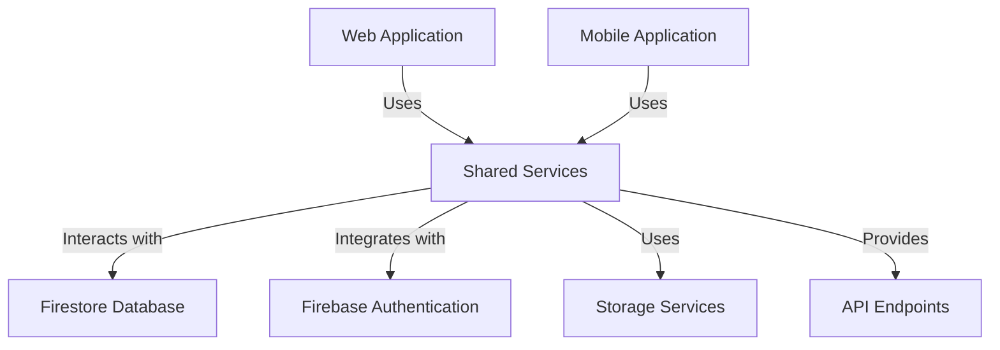
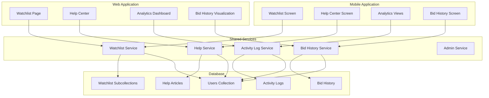

# eNumismatica.ro Comprehensive Feature Documentation

## Table of Contents

1. [Introduction](#introduction)
2. [Feature Overview](#feature-overview)
3. [Technical Architecture](#technical-architecture)
4. [API Documentation](#api-documentation)
5. [Database Schema](#database-schema)
6. [User Guides](#user-guides)
7. [Admin Guides](#admin-guides)
8. [Integration Guide](#integration-guide)
9. [Troubleshooting](#troubleshooting)
10. [Security Considerations](#security-considerations)
11. [Performance Optimization](#performance-optimization)

## Introduction

This comprehensive documentation covers all implemented features for the eNumismatica.ro platform, including:

- **Watchlist System**: Bookmarking functionality for products and auctions
- **User Activity Analytics**: Advanced user behavior tracking and analysis
- **Help Center**: Comprehensive knowledge base and support system
- **Bid History Visualization**: Interactive bid history tracking and visualization

## Feature Overview

### 1. Watchlist System

**Purpose**: Allows users to bookmark products and auctions they're interested in, creating a personalized watchlist for easy tracking and monitoring.

**Key Components**:
- Watchlist service with CRUD operations
- Real-time updates and notifications
- Cross-platform synchronization (web and mobile)
- Integration with product and auction systems

### 2. User Activity Analytics

**Purpose**: Provides comprehensive tracking and analysis of user behavior, engagement patterns, and platform usage.

**Key Components**:
- Activity logging service
- Behavioral pattern detection
- Session analytics and metrics
- Admin dashboard for monitoring
- Engagement scoring system

### 3. Help Center

**Purpose**: Offers a comprehensive knowledge base and support system for users and admins.

**Key Components**:
- Multi-language support (Romanian and English)
- Article management system
- Advanced search functionality
- User feedback on help content
- Admin content management interface

### 4. Bid History Visualization

**Purpose**: Provides interactive visualization and analysis of auction bid history.

**Key Components**:
- Real-time bid tracking
- Historical bid data analysis
- Visualization components
- Bid statistics and trends
- User bid history tracking

## Technical Architecture

### System Overview



### Component Relationships



### Cross-Platform Architecture

The eNumismatica.ro platform uses a shared services architecture where:

1. **Shared Services Layer**: Contains all business logic and data access
2. **Platform-Specific UI**: Web and mobile have their own UI components
3. **Unified API**: Single API layer accessible from both platforms
4. **Real-time Sync**: Firestore real-time updates keep both platforms in sync

## API Documentation

### Base URL
`https://api.enumismatica.ro/v1`

### Authentication
All API endpoints require Firebase authentication. Include the Firebase ID token in the `Authorization` header:
```
Authorization: Bearer {firebase_id_token}
```

### Watchlist API

#### Get User Watchlist
```
GET /api/watchlist/get
```
**Parameters**: None
**Response**:
```json
{
  "success": true,
  "items": [
    {
      "id": "watchlist_item_id",
      "userId": "user_id",
      "itemType": "product|auction",
      "itemId": "item_id",
      "addedAt": "2023-12-01T10:30:00Z",
      "notes": "User notes about this item"
    }
  ]
}
```

#### Add to Watchlist
```
POST /api/watchlist/add
```
**Request Body**:
```json
{
  "itemType": "product|auction",
  "itemId": "item_id",
  "notes": "Optional user notes"
}
```
**Response**:
```json
{
  "success": true,
  "watchlistItemId": "new_item_id"
}
```

#### Remove from Watchlist
```
POST /api/watchlist/remove
```
**Request Body**:
```json
{
  "itemId": "item_id_to_remove"
}
```
**Response**:
```json
{
  "success": true
}
```

### Help Center API

#### Get Help Articles
```
GET /api/help/articles
```
**Parameters**:
- `categoryId` (optional): Filter by category
- `language` (optional): 'ro' or 'en'
- `status` (optional): 'published', 'draft', or 'archived'
- `limit` (optional): Maximum number of results

**Response**:
```json
[
  {
    "id": "article_id",
    "title": "Article Title",
    "content": "HTML content",
    "categoryId": "category_id",
    "language": "en",
    "tags": ["tag1", "tag2"],
    "createdAt": "2023-12-01T10:30:00Z",
    "updatedAt": "2023-12-01T10:30:00Z",
    "views": 125,
    "helpfulCount": 42,
    "status": "published"
  }
]
```

#### Search Help Content
```
POST /api/help/search
```
**Request Body**:
```json
{
  "query": "search term",
  "language": "en"
}
```
**Response**:
```json
{
  "success": true,
  "results": [
    {
      "articleId": "article_id",
      "score": 0.95,
      "title": "Article Title",
      "contentPreview": "Preview text..."
    }
  ]
}
```

### User Activity Analytics API

#### Get User Activity Analytics
```
GET /api/admin/analytics/user-activity?userId={userId}
```
**Parameters**:
- `userId` (required): User ID to analyze

**Response**:
```json
{
  "success": true,
  "data": {
    "totalSessions": 42,
    "averageSessionDuration": 12.5,
    "engagementScore": 87,
    "behavioralPatterns": {
      "frequentActions": ["view_product", "place_bid"],
      "timeOfDayActivity": {
        "morning": 0.3,
        "afternoon": 0.5,
        "evening": 0.2
      }
    },
    "suspiciousActivityScore": 0.15,
    "recentActivity": [
      {
        "timestamp": "2023-12-01T10:30:00Z",
        "action": "view_product",
        "metadata": {
          "productId": "prod_123"
        }
      }
    ]
  }
}
```

### Bid History API

#### Get Auction Bid History
```
GET /api/bid-history?auctionId={auctionId}
```
**Parameters**:
- `auctionId` (required): Auction ID
- `limit` (optional): Maximum number of bids to return
- `page` (optional): Page number for pagination

**Response**:
```json
{
  "success": true,
  "bids": [
    {
      "id": "bid_id",
      "auctionId": "auction_id",
      "userId": "user_id",
      "amount": 150.00,
      "timestamp": "2023-12-01T10:30:00Z",
      "userName": "Username",
      "userAvatar": "avatar_url"
    }
  ],
  "stats": {
    "totalBids": 42,
    "highestBid": 250.00,
    "averageBid": 185.50,
    "bidFrequency": 0.75
  }
}
```

## Database Schema

### Users Collection
```typescript
interface User {
  id: string;
  email: string;
  name: string;
  role: 'user' | 'admin';
  createdAt: Date;
  lastLogin: Date;
  preferences: UserPreferences;
  helpPreferences: UserHelpPreferences;
  watchlistCount: number;
}
```

### Watchlist Subcollection
```typescript
interface WatchlistItem {
  id: string;
  userId: string;
  itemType: 'product' | 'auction';
  itemId: string;
  addedAt: Date;
  notes?: string;
  notificationPreferences?: {
    priceChanges: boolean;
    auctionUpdates: boolean;
    bidActivity: boolean;
  };
  lastNotified?: Date;
}
```

### Activity Logs Collection
```typescript
interface ActivityLog {
  id: string;
  userId: string;
  action: string;
  timestamp: Date;
  metadata: ActivityLogMetadata;
  ipAddress: string;
  userAgent: string;
  sessionId: string;
}

interface ActivityLogMetadata {
  productId?: string;
  auctionId?: string;
  bidAmount?: number;
  searchQuery?: string;
  pageUrl?: string;
  deviceInfo?: {
    browser: string;
    os: string;
    device: string;
  };
}
```

### Help Articles Collection
```typescript
interface HelpArticle {
  id: string;
  title: string;
  content: string;
  categoryId: string;
  language: 'ro' | 'en';
  tags: string[];
  createdAt: Date;
  updatedAt: Date;
  createdBy: string;
  views: number;
  helpfulCount: number;
  notHelpfulCount: number;
  status: 'draft' | 'published' | 'archived';
  version: number;
}
```

### Bid History Collection
```typescript
interface Bid {
  id: string;
  auctionId: string;
  userId: string;
  amount: number;
  timestamp: Date;
  autoBid: boolean;
  processed: boolean;
}

interface BidHistory extends Bid {
  userName: string;
  userAvatar: string;
  bidPosition: number;
  timeSincePreviousBid: number;
}
```

## User Guides

### Watchlist User Guide

#### Adding Items to Watchlist
1. Navigate to a product or auction page
2. Click the "Add to Watchlist" button (heart icon)
3. Optional: Add personal notes about the item
4. The item is now saved to your watchlist

#### Managing Your Watchlist
1. Go to the Watchlist page from the main navigation
2. View all your watched products and auctions
3. Use the tabs to switch between products and auctions
4. Click the heart icon on any item to remove it
5. Use the "Select" button for bulk operations

#### Watchlist Features
- **Real-time Updates**: See when watched items change
- **Notes**: Add personal notes to remember why you're interested
- **Notifications**: Get alerts for price changes and auction updates
- **Cross-Platform Sync**: Access your watchlist from web or mobile

### Help Center User Guide

#### Finding Help Articles
1. Navigate to the Help Center from the main menu
2. Browse categories in the sidebar
3. Use the search function to find specific topics
4. Click on any article to read the full content

#### Using Help Center Features
- **Language Selection**: Choose between Romanian and English
- **Article Feedback**: Rate articles as helpful or not helpful
- **Search**: Advanced search with natural language processing
- **Contextual Help**: Get help relevant to your current activity

#### Providing Feedback
1. At the bottom of each help article, use the feedback buttons
2. Rate the article as "Helpful" or "Not Helpful"
3. Your feedback helps improve the help content

### Bid History User Guide

#### Viewing Bid History
1. Navigate to an auction page
2. Click the "Bid History" tab or button
3. View the chronological list of all bids
4. See visualizations of bid patterns and trends

#### Understanding Bid Visualizations
- **Bid Timeline**: Shows when bids were placed over time
- **Bid Distribution**: Visual representation of bid amounts
- **Your Bids**: Highlights your own bids in the history
- **Statistics**: Shows highest bid, average bid, and frequency

## Admin Guides

### User Activity Analytics Admin Guide

#### Accessing Analytics Dashboard
1. Log in with admin credentials
2. Navigate to Admin → Analytics
3. Select the type of analytics you want to view

#### Monitoring User Activity
1. Go to the User Activity section
2. Select a specific user or view overall trends
3. Analyze engagement scores and behavioral patterns
4. Identify suspicious activity using the scoring system

#### Analytics Features
- **Behavioral Analysis**: Understand user behavior patterns
- **Session Metrics**: Track session duration and frequency
- **Engagement Scoring**: Measure user engagement levels
- **Suspicious Activity Detection**: Identify potential fraud or abuse

### Help Center Admin Guide

#### Managing Help Content
1. Navigate to Admin → Help Center
2. Create new help articles using the rich text editor
3. Organize articles into categories
4. Publish or archive articles as needed

#### Content Management Features
- **Article Editor**: Rich text editing with formatting options
- **Category Management**: Create and organize help categories
- **Multi-language Support**: Manage content in both Romanian and English
- **Analytics**: View article views and helpfulness ratings

#### Moderating User Feedback
1. View user feedback on help articles
2. Respond to user questions and concerns
3. Use feedback to improve help content
4. Track which articles need improvement

## Integration Guide

### Cross-Platform Integration

#### Shared Services Architecture
- All business logic resides in the `shared/` directory
- Both web and mobile platforms use the same services
- Real-time synchronization via Firestore listeners

#### Platform-Specific Considerations
- **Web**: Optimized for desktop browsers with larger screens
- **Mobile**: Touch-optimized interfaces with offline capabilities
- **Responsive Design**: All components adapt to different screen sizes

### Third-Party System Integration

#### Payment Gateway Integration
- Integrated with Stripe for secure payments
- Supports multiple currencies and payment methods
- Real-time transaction processing

#### Email Notification System
- Integrated with SendGrid for email delivery
- Transactional emails for account activities
- Marketing emails for promotions and updates

#### Analytics and Monitoring
- Google Analytics for user tracking
- Sentry for error monitoring
- Custom activity logging system

## Troubleshooting

### Common Issues and Solutions

#### Watchlist Issues
**Problem**: Items not appearing in watchlist
**Solution**:
1. Refresh the page or pull to refresh on mobile
2. Check your internet connection
3. Log out and log back in
4. Clear app cache if the issue persists

**Problem**: Watchlist not syncing between devices
**Solution**:
1. Ensure you're logged in with the same account
2. Check that both devices have internet connectivity
3. Try manually refreshing the watchlist
4. Contact support if sync issues continue

#### Help Center Issues
**Problem**: Search not returning expected results
**Solution**:
1. Try different search terms or keywords
2. Check your language selection
3. Browse categories manually
4. Clear search filters and try again

**Problem**: Help articles not loading
**Solution**:
1. Refresh the page
2. Check your internet connection
3. Try accessing from a different browser/device
4. Contact support if the issue persists

#### Analytics Issues
**Problem**: Analytics data not updating
**Solution**:
1. Refresh the analytics dashboard
2. Check that you have admin privileges
3. Verify the time range filters
4. Contact technical support if data issues continue

**Problem**: User activity not being tracked
**Solution**:
1. Ensure the user is properly authenticated
2. Check browser/mobile app permissions
3. Verify that tracking is enabled in user preferences
4. Contact support for advanced troubleshooting

## Security Considerations

### Authentication and Authorization
- Firebase Authentication for user management
- Role-based access control (admin vs regular users)
- JWT token validation for API endpoints
- Session management with secure cookies

### Data Protection
- Firestore security rules for database access
- Encryption of sensitive user data
- Regular security audits and vulnerability scanning
- Compliance with GDPR and data protection regulations

### Secure Coding Practices
- Input validation and sanitization
- Protection against XSS and CSRF attacks
- Rate limiting for API endpoints
- Secure password storage with hashing

### Admin Security
- Multi-factor authentication for admin accounts
- Activity logging for all admin actions
- IP whitelisting for sensitive operations
- Regular security training for admin users

## Performance Optimization

### Frontend Optimization
- Code splitting and lazy loading
- Image optimization and compression
- Caching strategies for frequently accessed data
- Bundle size monitoring and optimization

### Backend Optimization
- Firestore query optimization with indexes
- Database caching for common queries
- Batch processing for large operations
- Connection pooling for database access

### Network Optimization
- CDN integration for static assets
- HTTP/2 protocol support
- Compression for API responses
- Minification of CSS and JavaScript

### Monitoring and Maintenance
- Performance metrics tracking
- Regular load testing
- Continuous performance profiling
- Automated optimization pipelines

## Conclusion

This comprehensive documentation provides a complete reference for all implemented features in the eNumismatica.ro platform. The documentation covers technical implementation details, user guides, admin guides, and operational considerations to ensure successful usage and maintenance of the system.

For additional support or questions not covered in this documentation, please contact the technical support team at support@enumismatica.ro.