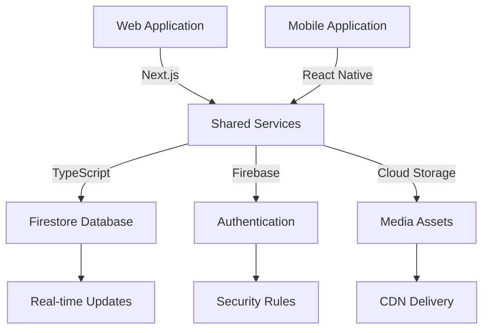
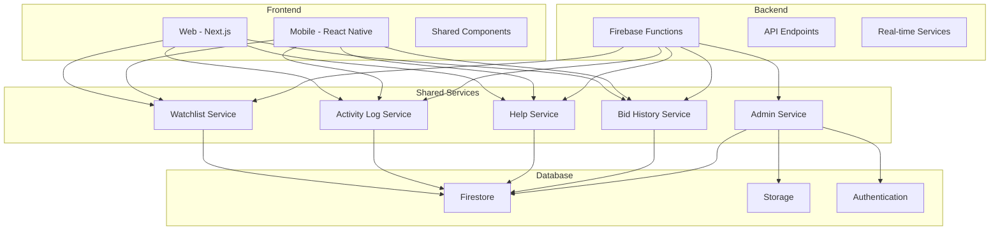
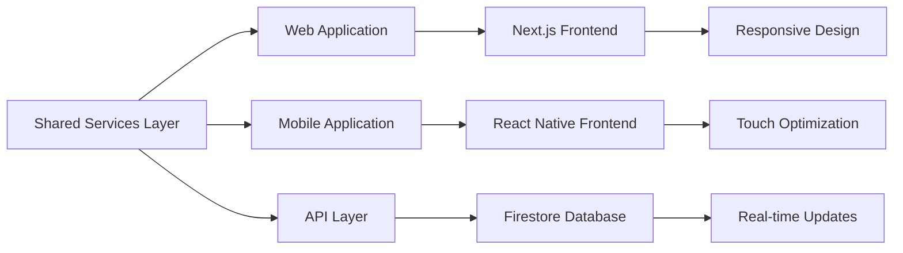
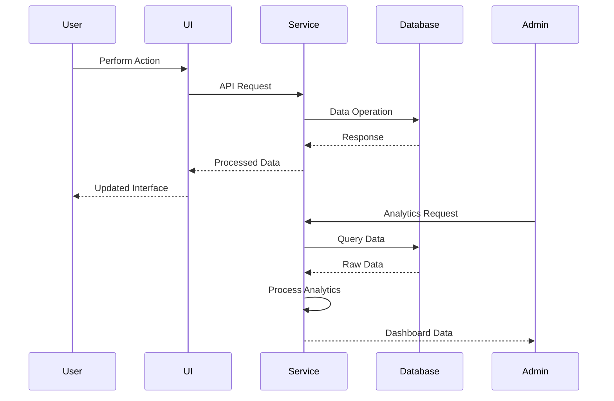
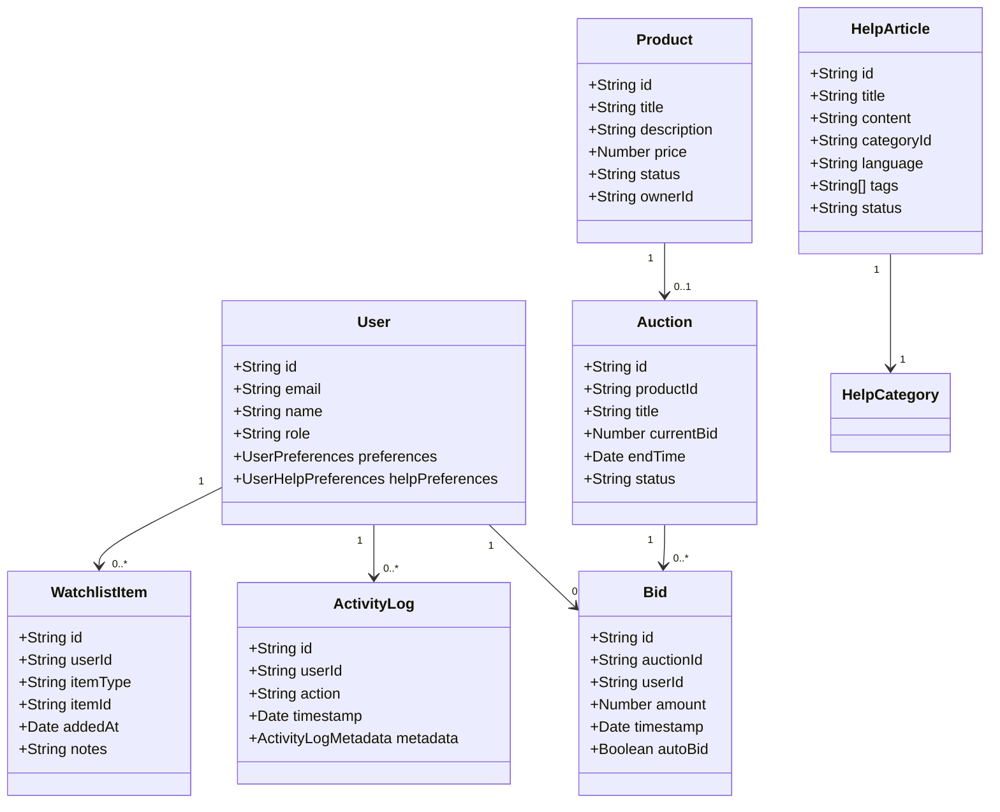

# eNumismatica.ro Comprehensive Documentation Index

## 📚 Documentation Overview

This index provides a comprehensive guide to all documentation for the eNumismatica.ro platform, covering all implemented features with technical details, user guides, and administrative information.

## 🗺️ Navigation Guide

### Quick Start
- [Platform Overview](#platform-overview)
- [Feature Summary](#feature-summary)
- [Getting Started Guide](#getting-started-guide)
- [Documentation Structure](#documentation-structure)

### Feature Documentation
- [🔖 Watchlist System](#watchlist-system)
- [📊 User Activity Analytics](#user-activity-analytics)
- [🆘 Help Center](#help-center)
- [💰 Bid History Visualization](#bid-history-visualization)

### Technical Resources
- [🏗️ Technical Architecture](#technical-architecture)
- [🔌 API Documentation](#api-documentation)
- [🗃️ Database Schema](#database-schema)
- [🔒 Security Considerations](#security-considerations)
- [⚡ Performance Optimization](#performance-optimization)

### User Resources
- [👤 User Guides](#user-guides)
- [👔 Admin Guides](#admin-guides)
- [🔧 Troubleshooting](#troubleshooting)
- [🤝 Integration Guide](#integration-guide)

## 🌐 Platform Overview

### About eNumismatica.ro

eNumismatica.ro is a comprehensive online platform for coin collectors, numismatists, and auction enthusiasts. The platform provides:

- **Auction Marketplace**: Buy and sell rare coins and collections
- **Product Catalog**: Browse and purchase numismatic items
- **Community Features**: Connect with other collectors
- **Advanced Tools**: Powerful features for serious collectors

### Platform Architecture



### Technology Stack

| Component | Technology | Purpose |
|-----------|------------|---------|
| **Frontend** | Next.js, React Native | Web and mobile interfaces |
| **Backend** | Firebase Functions | Serverless API endpoints |
| **Database** | Firestore | Real-time NoSQL database |
| **Authentication** | Firebase Auth | User authentication |
| **Storage** | Firebase Storage | Media file storage |
| **Analytics** | Custom + Google | User behavior tracking |
| **Testing** | Jest, Playwright | Unit and integration testing |

## 🎯 Feature Summary

### 🔖 Watchlist System

**Purpose**: Bookmark products and auctions for easy tracking

**Key Features**:
- Cross-platform synchronization (web & mobile)
- Real-time updates and notifications
- Personal notes and organization
- Bulk management capabilities

**Documentation**:
- [Complete Watchlist Documentation](WATCHLIST_FEATURE_DOCUMENTATION.md)
- [API Reference](#watchlist-api)
- [User Guide](#watchlist-user-guide)

### 📊 User Activity Analytics

**Purpose**: Comprehensive tracking and analysis of user behavior

**Key Features**:
- Activity logging and pattern detection
- Engagement scoring system
- Behavioral analysis dashboard
- Suspicious activity detection
- Real-time monitoring

**Documentation**:
- [Complete Analytics Documentation](USER_ACTIVITY_ANALYTICS_DOCUMENTATION.md)
- [API Reference](#analytics-api)
- [Admin Guide](#analytics-admin-guide)

### 🆘 Help Center

**Purpose**: Comprehensive knowledge base and support system

**Key Features**:
- Multi-language support (Romanian & English)
- Advanced search with natural language processing
- Content management system
- User feedback and ratings
- Contextual help integration

**Documentation**:
- [Complete Help Center Documentation](HELP_CENTER_DOCUMENTATION.md)
- [API Reference](#help-center-api)
- [User Guide](#help-center-user-guide)

### 💰 Bid History Visualization

**Purpose**: Interactive tracking and visualization of auction bids

**Key Features**:
- Real-time bid tracking
- Historical bid analysis
- Interactive visualizations
- Bid statistics and trends
- Competition analysis

**Documentation**:
- [Complete Bid History Documentation](BID_HISTORY_VISUALIZATION_DOCUMENTATION.md)
- [API Reference](#bid-history-api)
- [User Guide](#bid-history-user-guide)

## 🚀 Getting Started Guide

### For New Users

1. **Create Account**: Sign up with email or Google
2. **Complete Profile**: Add your collector interests
3. **Explore Features**: Try watchlist, help center, and bidding
4. **Set Preferences**: Configure notifications and language
5. **Start Collecting**: Browse auctions and products

### For Developers

1. **Clone Repository**: Get the latest codebase
2. **Install Dependencies**: Run `npm install` in all modules
3. **Set Up Environment**: Configure Firebase and API keys
4. **Run Locally**: Start development servers
5. **Explore Documentation**: Review feature implementations

### For Administrators

1. **Access Admin Panel**: Log in with admin credentials
2. **Review Dashboard**: Check platform statistics
3. **Manage Content**: Update help articles and categories
4. **Monitor Activity**: Analyze user behavior and bidding
5. **Configure Settings**: Adjust platform parameters

## 🏗️ Technical Architecture

### System Architecture



### Cross-Platform Architecture



### Data Flow Architecture



## 🔌 API Documentation

### API Base URL
`https://api.enumismatica.ro/v1`

### Authentication
All API endpoints require Firebase authentication with the Firebase ID token in the `Authorization` header:
```
Authorization: Bearer {firebase_id_token}
```

### 🔖 Watchlist API

**Endpoints**:
- `GET /api/watchlist/get` - Get user's watchlist
- `POST /api/watchlist/add` - Add item to watchlist
- `POST /api/watchlist/remove` - Remove item from watchlist
- `POST /api/watchlist/clear` - Clear entire watchlist
- `GET /api/watchlist/check` - Check if item is in watchlist

**Example Request**:
```bash
curl -X GET "https://api.enumismatica.ro/v1/api/watchlist/get" \
     -H "Authorization: Bearer FIREBASE_ID_TOKEN"
```

### 📊 Analytics API

**Endpoints**:
- `GET /api/admin/analytics/user-activity` - User activity analytics
- `GET /api/admin/analytics/behavioral-patterns` - Behavioral patterns
- `GET /api/admin/analytics/session-metrics` - Session metrics

**Example Request**:
```bash
curl -X GET "https://api.enumismatica.ro/v1/api/admin/analytics/user-activity?userId=USER_ID" \
     -H "Authorization: Bearer FIREBASE_ID_TOKEN"
```

### 🆘 Help Center API

**Endpoints**:
- `GET /api/help/articles` - Get help articles
- `POST /api/help/search` - Search help content
- `GET /api/help/categories` - Get help categories
- `POST /api/help/feedback` - Submit feedback

**Example Request**:
```bash
curl -X POST "https://api.enumismatica.ro/v1/api/help/search" \
     -H "Authorization: Bearer FIREBASE_ID_TOKEN" \
     -H "Content-Type: application/json" \
     -d '{"query":"how to bid","language":"en"}'
```

### 💰 Bid History API

**Endpoints**:
- `GET /api/bid-history` - Get auction bid history
- `GET /api/bid-history/user` - Get user bid history
- `GET /api/bid-history/trends` - Get bidding trends

**Example Request**:
```bash
curl -X GET "https://api.enumismatica.ro/v1/api/bid-history?auctionId=AUCTION_ID" \
     -H "Authorization: Bearer FIREBASE_ID_TOKEN"
```

## 🗃️ Database Schema

### Core Collections



### Collection Relationships

```
users/
  {userId}/
    watchlist/
      {watchlistItemId}
    helpPreferences/
      {preferencesId}
    bidHistory/
      {bidId} (reference)

products/
  {productId}

auctions/
  {auctionId}/
    bids/
      {bidId} (reference)

helpArticles/
  {articleId}

helpCategories/
  {categoryId}

activityLogs/
  {logId}

bids/
  {bidId}
```

## 👤 User Guides

### 🔖 Watchlist User Guide

**Getting Started**:
1. Navigate to any product or auction
2. Click the heart icon to add to watchlist
3. Access your watchlist from the main menu
4. Manage items with bulk operations

**Advanced Features**:
- Add personal notes to watchlist items
- Set notification preferences
- View cross-platform synchronized watchlist
- Export watchlist data

[Complete Watchlist User Guide](WATCHLIST_FEATURE_DOCUMENTATION.md#user-guide)

### 📊 Analytics User Guide

**Viewing Your Activity**:
1. Go to your profile page
2. Click "My Activity" tab
3. View your engagement score and patterns
4. See recent actions and session history

**Understanding Metrics**:
- **Engagement Score**: Measures your platform usage
- **Behavior Patterns**: Shows your typical activities
- **Session Metrics**: Tracks your visit frequency

[Complete Analytics User Guide](USER_ACTIVITY_ANALYTICS_DOCUMENTATION.md#user-guide)

### 🆘 Help Center User Guide

**Finding Help**:
1. Click "Help Center" in main navigation
2. Browse categories or use search
3. Read articles with rich formatting
4. Provide feedback on helpfulness

**Advanced Features**:
- Save favorite articles
- Multi-language support
- Contextual help suggestions
- Print or share articles

[Complete Help Center User Guide](HELP_CENTER_DOCUMENTATION.md#user-guide)

### 💰 Bid History User Guide

**Viewing Bid History**:
1. Go to any auction page
2. Click "Bid History" tab
3. See chronological bid list
4. Explore interactive visualizations

**Analyzing Bids**:
- Track your own bids
- Identify bidding patterns
- Predict auction outcomes
- Export bid data for analysis

[Complete Bid History User Guide](BID_HISTORY_VISUALIZATION_DOCUMENTATION.md#user-guide)

## 👔 Admin Guides

### 🔖 Watchlist Admin Guide

**Monitoring Usage**:
1. Access admin analytics dashboard
2. View watchlist adoption metrics
3. Analyze user engagement patterns
4. Export usage statistics

**Management**:
- View aggregate watchlist statistics
- Monitor feature performance
- Identify power users

[Complete Watchlist Admin Guide](WATCHLIST_FEATURE_DOCUMENTATION.md#admin-guide)

### 📊 Analytics Admin Guide

**Accessing Dashboard**:
1. Log in with admin credentials
2. Navigate to Admin → Analytics
3. Select analysis type

**Advanced Features**:
- Behavioral pattern detection
- Suspicious activity monitoring
- User segmentation analysis
- Custom report generation

[Complete Analytics Admin Guide](USER_ACTIVITY_ANALYTICS_DOCUMENTATION.md#admin-guide)

### 🆘 Help Center Admin Guide

**Content Management**:
1. Go to Admin → Help Center
2. Create or edit articles
3. Organize categories
4. Manage multi-language content

**Analytics**:
- Track article performance
- Monitor user feedback
- Analyze search patterns
- Export help center metrics

[Complete Help Center Admin Guide](HELP_CENTER_DOCUMENTATION.md#admin-guide)

### 💰 Bid History Admin Guide

**Bid Analysis**:
1. Access auction analytics
2. View complete bid histories
3. Detect suspicious patterns
4. Generate bid reports

**Advanced Tools**:
- Collusion detection
- Shill bidding analysis
- Market trend tracking
- Competition intensity scoring

[Complete Bid History Admin Guide](BID_HISTORY_VISUALIZATION_DOCUMENTATION.md#admin-guide)

## 🔧 Troubleshooting

### Common Issues by Feature

#### 🔖 Watchlist Issues
- **Items not appearing**: Refresh page, check connection
- **Sync problems**: Verify same account, check network
- **Button not working**: Clear cache, check authentication

#### 📊 Analytics Issues
- **Data not updating**: Refresh dashboard, check permissions
- **Missing activity**: Verify tracking implementation
- **Performance slow**: Optimize queries, check indexes

#### 🆘 Help Center Issues
- **Articles not loading**: Refresh page, check connection
- **Search not working**: Verify search service, test different terms
- **Feedback not saving**: Check authentication, verify permissions

#### 💰 Bid History Issues
- **History not loading**: Refresh page, check auction status
- **Visualizations failing**: Check browser compatibility, verify data
- **Real-time updates**: Verify Firestore connection, check listeners

### General Troubleshooting Steps

1. **Refresh the Page/App**: Often resolves temporary issues
2. **Check Network Connection**: Ensure stable internet
3. **Verify Authentication**: Log out and back in
4. **Clear Cache**: Remove browser/app cache
5. **Check Status Page**: Visit platform status page
6. **Contact Support**: If issues persist

### Debugging Tools

- **Browser DevTools**: For web issues
- **Mobile Debugging**: Flipper/Android Studio
- **API Testing**: Postman/Insomnia
- **Database Console**: Firestore interface
- **Error Monitoring**: Sentry/Datadog

## 🤝 Integration Guide

### Cross-Platform Integration

**Shared Services Architecture**:
- All business logic in `shared/` directory
- Consistent API across web and mobile
- Real-time synchronization via Firestore

**Platform-Specific Considerations**:
- **Web**: Optimized for desktop browsers
- **Mobile**: Touch-optimized interfaces
- **Responsive**: Adapts to all screen sizes

### Third-Party Integrations

**Payment Gateways**:
- Stripe integration
- Multi-currency support
- Secure transaction processing

**Analytics Platforms**:
- Google Analytics
- Mixpanel
- Hotjar

**Notification Systems**:
- Firebase Cloud Messaging
- Email notifications
- In-app alerts

### Implementation Patterns

**Feature Integration Checklist**:
1. Implement shared service
2. Create platform-specific UI
3. Add API endpoints
4. Set up database collections
5. Configure security rules
6. Add testing coverage
7. Document features

## 🔒 Security Considerations

### Authentication & Authorization
- Firebase Authentication integration
- Role-based access control
- JWT token validation
- Session management

### Data Protection
- Firestore security rules
- Encryption of sensitive data
- Regular security audits
- GDPR compliance

### Secure Coding Practices
- Input validation and sanitization
- XSS and CSRF protection
- Rate limiting for APIs
- Secure password storage

### Platform-Specific Security

**Web Security**:
- CSP headers
- HTTPS enforcement
- Secure cookies
- CSRF protection

**Mobile Security**:
- App signing
- Secure storage
- Biometric authentication
- Certificate pinning

**Admin Security**:
- Multi-factor authentication
- Activity logging
- IP whitelisting
- Regular security training

## ⚡ Performance Optimization

### Optimization Strategies

**Frontend Optimization**:
- Code splitting and lazy loading
- Image optimization
- Caching strategies
- Bundle size monitoring

**Backend Optimization**:
- Firestore query optimization
- Database caching
- Batch processing
- Connection pooling

**Network Optimization**:
- CDN integration
- HTTP/2 support
- Response compression
- Minification

### Monitoring Tools

- Performance metrics tracking
- Error rate monitoring
- Usage pattern analysis
- Resource usage monitoring

### Continuous Improvement

- Regular performance reviews
- Automated optimization pipelines
- Load testing procedures
- User experience monitoring

## 📚 Documentation Structure

```
📁 Documentation/
├── 📄 DOCUMENTATION_INDEX.md (This file)
├── 📄 COMPREHENSIVE_FEATURE_DOCUMENTATION.md (Overview)
├── 📄 WATCHLIST_FEATURE_DOCUMENTATION.md
├── 📄 USER_ACTIVITY_ANALYTICS_DOCUMENTATION.md
├── 📄 HELP_CENTER_DOCUMENTATION.md
├── 📄 BID_HISTORY_VISUALIZATION_DOCUMENTATION.md
└── 📁 assets/ (Diagrams, images, etc.)
```

### Documentation Conventions

- **📘 Feature Docs**: Complete feature documentation
- **🔧 Technical**: Implementation details and APIs
- **👤 User Guides**: Step-by-step user instructions
- **👔 Admin Guides**: Administrative procedures
- **🔍 Troubleshooting**: Common issues and solutions

## 🎓 Learning Resources

### For Users
- [Getting Started Video Tutorials](#)
- [Platform Walkthrough Guide](#)
- [FAQ and Common Questions](#)

### For Developers
- [Architecture Deep Dive](#)
- [Contribution Guidelines](#)
- [API Reference Guide](#)

### For Administrators
- [Admin Training Materials](#)
- [Platform Configuration Guide](#)
- [Security Best Practices](#)

## 📞 Support & Contact

### Support Channels
- **Email**: support@enumismatica.ro
- **Phone**: +40 740 123 456
- **Live Chat**: Available during business hours
- **Community Forum**: forum.enumismatica.ro

### Documentation Feedback
- **Issues**: Report documentation problems
- **Suggestions**: Propose improvements
- **Contributions**: Help improve documentation

### Technical Support
- **Development**: dev@enumismatica.ro
- **Security**: security@enumismatica.ro
- **API Support**: api@enumismatica.ro

## 🔄 Version History

### Documentation Versions
- **v1.0**: Initial comprehensive documentation
- **v1.1**: Added detailed feature guides
- **v1.2**: Enhanced API documentation
- **v1.3**: Added troubleshooting sections

### Platform Versions
- **v2.0**: Current stable release
- **v2.1**: Upcoming feature enhancements
- **v3.0**: Major architecture updates

## 📝 License & Usage

### Documentation License
This documentation is licensed under [CC BY-SA 4.0](https://creativecommons.org/licenses/by-sa/4.0/)

### Usage Guidelines
- Free to use and modify
- Attribution required
- Share improvements with community
- Commercial use permitted

### Contribution Policy
- Submit pull requests for improvements
- Follow documentation style guide
- Include examples and diagrams
- Update version history

## 🎯 Conclusion

This comprehensive documentation provides everything needed to understand, use, and administer the eNumismatica.ro platform. From detailed feature documentation to API references and troubleshooting guides, all aspects of the platform are covered.

For the most up-to-date information, always refer to the latest version of this documentation and the official platform resources.

**Last Updated**: December 2, 2025
**Version**: 1.0
**Maintainers**: eNumismatica.ro Development Team