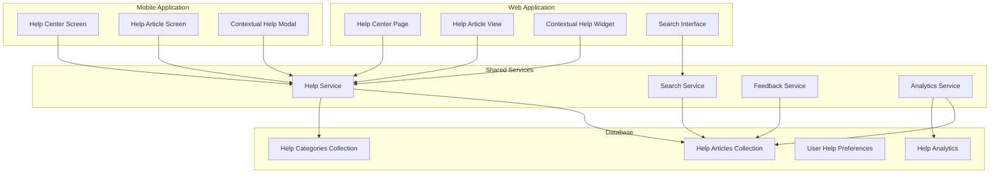
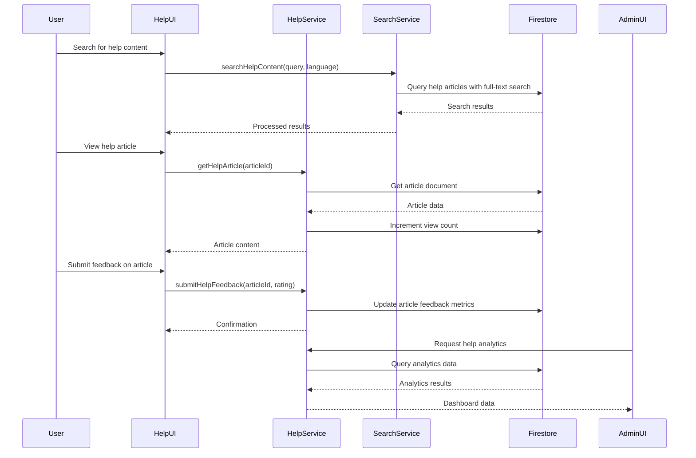

# Help Center Documentation

## Table of Contents

1. [Feature Overview](#feature-overview)
2. [Technical Architecture](#technical-architecture)
3. [API Documentation](#api-documentation)
4. [Database Schema](#database-schema)
5. [User Guide](#user-guide)
6. [Admin Guide](#admin-guide)
7. [Integration Points](#integration-points)
8. [Troubleshooting](#troubleshooting)
9. [Security Considerations](#security-considerations)
10. [Performance Optimization](#performance-optimization)

## Feature Overview

### Purpose

The Help Center provides a comprehensive knowledge base and support system for eNumismatica.ro users. It offers multi-language support, advanced search functionality, and a robust content management system to reduce support burden and improve user self-service capabilities.

### Key Features

- **Multi-Language Support**: Content available in both Romanian and English
- **Advanced Search**: Natural language processing for finding help content
- **Content Management**: Admin interface for creating and organizing help articles
- **User Feedback**: System for users to rate help article usefulness
- **Contextual Help**: In-app help that adapts to user context
- **Analytics**: Track article views and helpfulness ratings

### Business Value

- **Reduced Support Costs**: Users can find answers without contacting support
- **Improved User Satisfaction**: Comprehensive self-service options
- **Better Onboarding**: New users can learn platform features easily
- **Continuous Improvement**: User feedback drives content quality improvements
- **Multi-Lingual Support**: Serves both Romanian and international users

## Technical Architecture

### Component Diagram



### Data Flow



### Service Implementation

The help center service is implemented in `shared/helpService.ts` with comprehensive functionality:

```typescript
// Help article management
export async function createHelpArticle(articleData: Omit<HelpArticle, 'id'>)
export async function updateHelpArticle(articleId: string, updates: Partial<HelpArticle>)
export async function getHelpArticle(articleId: string)
export async function getHelpArticles(filter?: HelpArticleFilter)

// Help category management
export async function createHelpCategory(categoryData: Omit<HelpCategory, 'id'>)
export async function getHelpCategories(language?: 'ro' | 'en')

// Search functionality
export async function searchHelpContent(query: string, language: 'ro' | 'en')

// User feedback
export async function submitHelpFeedback(articleId: string, rating: 'helpful' | 'not_helpful')

// Analytics
export async function getHelpAnalytics()
export async function getPopularHelpArticles(limit: number = 10)
```

## API Documentation

### Base Endpoints

All help center API endpoints are prefixed with `/api/help/`

### Authentication

Most endpoints are publicly accessible. Admin endpoints require Firebase authentication and admin privileges.

### Endpoints

#### GET /api/help/articles

**Description**: Get help articles with optional filtering

**Parameters**:
- `categoryId` (optional): Filter by category
- `language` (optional): 'ro' or 'en'
- `status` (optional): 'published', 'draft', or 'archived'
- `limit` (optional): Maximum number of results
- `tags` (optional): Comma-separated list of tags

**Response**:
```json
[
  {
    "id": "article_id",
    "title": "How to Place a Bid",
    "content": "<p>Step-by-step guide...</p>",
    "categoryId": "bidding",
    "language": "en",
    "tags": ["bidding", "auction", "beginner"],
    "createdAt": "2023-12-01T10:30:00Z",
    "updatedAt": "2023-12-01T10:30:00Z",
    "createdBy": "admin_user_id",
    "views": 125,
    "helpfulCount": 42,
    "notHelpfulCount": 3,
    "status": "published",
    "version": 1
  }
]
```

#### POST /api/help/search

**Description**: Search help content with natural language processing

**Request Body**:
```json
{
  "query": "how to create auction",
  "language": "en"
}
```

**Response**:
```json
{
  "success": true,
  "results": [
    {
      "articleId": "create_auction_guide",
      "score": 0.95,
      "title": "Creating Your First Auction",
      "contentPreview": "Learn how to set up and manage auctions on eNumismatica.ro...",
      "category": "Auctions",
      "views": 87,
      "helpfulRating": 0.92
    }
  ]
}
```

#### GET /api/help/categories

**Description**: Get all help categories

**Parameters**:
- `language` (optional): 'ro' or 'en'

**Response**:
```json
[
  {
    "id": "getting_started",
    "name": "Getting Started",
    "description": "Basic platform usage guides",
    "order": 1,
    "icon": "book",
    "language": "en"
  }
]
```

#### POST /api/help/feedback

**Description**: Submit feedback on a help article

**Request Body**:
```json
{
  "articleId": "article_id",
  "rating": "helpful" | "not_helpful",
  "comment": "Optional additional feedback"
}
```

**Response**:
```json
{
  "success": true,
  "message": "Feedback submitted successfully"
}
```

#### GET /api/help/popular

**Description**: Get most viewed and helpful articles

**Parameters**:
- `limit` (optional): Maximum number of results (default: 10)
- `language` (optional): 'ro' or 'en'

**Response**:
```json
{
  "mostViewed": [
    {
      "id": "bidding_guide",
      "title": "Advanced Bidding Strategies",
      "views": 428,
      "helpfulRating": 0.89
    }
  ],
  "mostHelpful": [
    {
      "id": "account_setup",
      "title": "Setting Up Your Account",
      "views": 312,
      "helpfulRating": 0.97
    }
  ]
}
```

## Database Schema

### Help Article Structure

```typescript
interface HelpArticle {
  id: string;                    // Auto-generated document ID
  title: string;                 // Article title
  content: string;               // HTML content with formatting
  categoryId: string;            // Reference to help category
  language: 'ro' | 'en';         // Article language
  tags: string[];                // Search and organization tags
  createdAt: Date;               // Creation timestamp
  updatedAt: Date;               // Last update timestamp
  createdBy: string;             // Admin user ID who created
  views: number;                 // Total view count
  helpfulCount: number;          // Number of "helpful" ratings
  notHelpfulCount: number;       // Number of "not helpful" ratings
  status: 'draft' | 'published' | 'archived'; // Publication status
  version: number;               // Content version number
  relatedArticles?: string[];    // IDs of related articles
}
```

### Help Category Structure

```typescript
interface HelpCategory {
  id: string;                    // Auto-generated document ID
  name: string;                  // Category name
  description: string;           // Category description
  order: number;                 // Display order
  parentCategoryId?: string;     // Parent category if hierarchical
  icon?: string;                 // Optional icon name
  language: 'ro' | 'en';         // Category language
  articleCount?: number;         // Number of articles in category
}
```

### User Help Preferences

```typescript
interface UserHelpPreferences {
  preferredLanguage: 'ro' | 'en'; // User's preferred help language
  viewedArticles: string[];       // IDs of articles user has viewed
  helpfulRatings: Record<string, 'helpful' | 'not_helpful'>; // User's ratings
  searchHistory?: string[];       // Recent search queries
  lastHelpAccess?: Date;          // Last time user accessed help
}
```

### Firestore Structure

```
helpArticles/
  {articleId}/
    - title: string
    - content: string
    - categoryId: string
    - language: string
    - tags: array
    - createdAt: timestamp
    - updatedAt: timestamp
    - createdBy: string
    - views: number
    - helpfulCount: number
    - notHelpfulCount: number
    - status: string
    - version: number

helpCategories/
  {categoryId}/
    - name: string
    - description: string
    - order: number
    - language: string
    - icon: string (optional)

helpAnalytics/
  {analyticsId}/
    - articleId: string
    - date: timestamp
    - views: number
    - helpfulRatings: number
    - searchHits: number
```

### Security Rules

```javascript
// Firestore security rules for help center
match /helpArticles/{articleId} {
  allow read: if true; // Public read access
  allow create, update: if request.auth != null && isAdmin();
  allow delete: if request.auth != null && isAdmin();
}

match /helpCategories/{categoryId} {
  allow read: if true; // Public read access
  allow create, update, delete: if request.auth != null && isAdmin();
}

match /users/{userId}/helpPreferences/{preferencesId} {
  allow read, write: if request.auth != null && request.auth.uid == userId;
}
```

## User Guide

### Accessing the Help Center

#### Web Platform
1. Click "Help Center" in the main navigation
2. Browse categories in the left sidebar
3. Use the search bar to find specific topics
4. Click any article to read the full content

#### Mobile Platform
1. Tap the "Help" icon in the app menu
2. Swipe through categories or use search
3. Tap any article to view detailed help content
4. Use the back button to return to category listing

### Finding Help Content

#### Browsing by Category
1. Select a category from the sidebar
2. View all articles in that category
3. Click "Show More" to see additional articles
4. Use subcategories if available

#### Using Search
1. Type your question or keywords in the search box
2. Press Enter or click the search button
3. Review search results with relevance scores
4. Click "View All Results" for comprehensive listing

#### Contextual Help
- Help suggestions appear based on your current activity
- Relevant articles are highlighted in the sidebar
- Quick access to frequently needed help topics

### Using Help Articles

#### Reading Articles
- Articles support rich text formatting
- Images and diagrams may be included
- Related articles are suggested at the bottom
- Print or share options are available

#### Providing Feedback
1. At the bottom of each article, find the feedback section
2. Click "Helpful" or "Not Helpful" to rate the article
3. Optional: Add comments about what could be improved
4. Your feedback helps improve the help content

#### Saving Favorite Articles
1. Click the bookmark icon on useful articles
2. Access saved articles from your profile
3. Quickly find articles you've found helpful before

## Admin Guide

### Accessing Help Center Management

#### Navigation
1. Log in with admin credentials
2. Click "Admin" in the main navigation
3. Select "Help Center" from the admin menu
4. Choose between article management and analytics

### Managing Help Articles

#### Creating New Articles
1. Click "Create New Article" button
2. Fill in title, content, and metadata
3. Select appropriate category and tags
4. Choose publication status (draft/published)
5. Click "Save" to create the article

#### Editing Existing Articles
1. Find the article in the management list
2. Click "Edit" to open the article editor
3. Make changes to content or metadata
4. Update the version number if significant changes
5. Click "Save Changes" to update

#### Article Management Features
- **Rich Text Editor**: Full formatting options for content
- **Version Control**: Track article revisions and history
- **Multi-Language Support**: Create and manage translations
- **SEO Optimization**: Add meta tags and descriptions

### Managing Help Categories

#### Category Organization
1. Go to the Categories tab in admin
2. Create new categories with names and descriptions
3. Set display order for proper organization
4. Create hierarchical categories if needed

#### Category Features
- **Icon Selection**: Visual identifiers for categories
- **Order Management**: Control display priority
- **Multi-Language**: Separate categories for each language
- **Article Counting**: Automatic tracking of articles per category

### Help Center Analytics

#### Viewing Analytics Dashboard
1. Navigate to the Analytics tab
2. View overall help center performance
3. See most viewed and helpful articles
4. Analyze user feedback trends

#### Analytics Features
- **Popular Articles**: Identify most accessed content
- **Helpfulness Ratings**: Track article quality
- **Search Analytics**: Understand what users are looking for
- **User Engagement**: Measure help center usage patterns

#### Exporting Analytics Data
1. Click the export button in analytics view
2. Choose format (CSV, JSON, Excel)
3. Select time range for data export
4. Download the analytics report

## Integration Points

### Cross-Platform Integration

#### Shared Help Service
- Both web and mobile use the same help services
- Consistent content delivery across platforms
- Unified search and analytics

#### Platform-Specific Implementations
- **Web**: Full-featured help center with rich content
- **Mobile**: Optimized for smaller screens with touch navigation

### Third-Party Integrations

#### Search Enhancement
- Algolia integration for advanced search capabilities
- Natural language processing for better results
- Typo tolerance and query suggestions

#### Content Management
- Integration with content creation tools
- Markdown and rich text support
- Image and media management

#### Analytics Platforms
- Google Analytics for usage tracking
- Hotjar for user behavior analysis
- Custom help center analytics

## Troubleshooting

### Common Issues and Solutions

#### Help Articles Not Loading
**Symptoms**: Articles fail to load or show errors
**Causes**:
- Network connectivity issues
- Firestore permission problems
- Content formatting errors
- Caching issues

**Solutions**:
1. Refresh the page or app
2. Check internet connection
3. Verify Firestore security rules
4. Clear cache and reload
5. Check content for invalid formatting

#### Search Not Working
**Symptoms**: Search returns no results or irrelevant content
**Causes**:
- Search service errors
- Indexing problems
- Query parsing issues
- Content not properly indexed

**Solutions**:
1. Check search service status
2. Verify Firestore indexes
3. Test with different search terms
4. Rebuild search indexes
5. Check content for proper tagging

#### Feedback Not Saving
**Symptoms**: User feedback not being recorded
**Causes**:
- Authentication issues
- Database write permissions
- Service implementation errors
- Network problems

**Solutions**:
1. Verify user authentication
2. Check Firestore security rules
3. Test feedback service directly
4. Review service error logs
5. Check network connectivity

### Debugging Tools

#### Admin Content Tools
- Preview articles before publishing
- Validate content formatting
- Test search functionality
- Monitor feedback submission

#### Database Tools
- Direct Firestore inspection of help content
- Query performance analysis
- Index management interface

#### Monitoring Dashboards
- Help center usage metrics
- Search performance monitoring
- Content quality tracking

## Security Considerations

### Content Security
- Help content is sanitized to prevent XSS attacks
- Admin-only access to content management
- Content approval workflows
- Regular security audits of help content

### Data Protection
- User help preferences are private
- Feedback data is protected
- Compliance with content regulations
- Secure transmission of help content

### Access Control
- Public read access to published content
- Admin-only write access
- Role-based permissions for management
- Audit logging for content changes

### Compliance
- Content accessibility standards
- Multi-language support requirements
- Data protection for user preferences
- Regular content reviews

## Performance Optimization

### Content Delivery
- **Caching**: Cache frequently accessed help articles
- **CDN Integration**: Serve help content from edge locations
- **Lazy Loading**: Load article content progressively
- **Compression**: Compress help content for faster delivery

### Search Optimization
- **Indexing**: Proper Firestore indexes for search
- **Query Optimization**: Efficient search algorithms
- **Result Caching**: Cache common search results
- **Pagination**: Limit search result sizes

### Analytics Processing
- **Batch Processing**: Process analytics in batches
- **Incremental Updates**: Update metrics incrementally
- **Sampling**: Use statistical sampling for large datasets
- **Scheduled Processing**: Run analytics during off-peak hours

### Monitoring and Maintenance
- **Content Quality**: Track article helpfulness ratings
- **Search Performance**: Monitor search response times
- **Usage Patterns**: Analyze help center access trends
- **Resource Usage**: Monitor database and compute resources

## Conclusion

The Help Center provides a comprehensive self-service support system that reduces support burden while improving user satisfaction. With multi-language support, advanced search capabilities, and robust content management, it serves as the foundation for user education and platform documentation.

The system balances powerful content management features with strong security protections and performance optimizations to ensure reliable and efficient operation across all platforms.

For content management support or technical questions about the help center implementation, please contact the support team at help@enumismatica.ro.