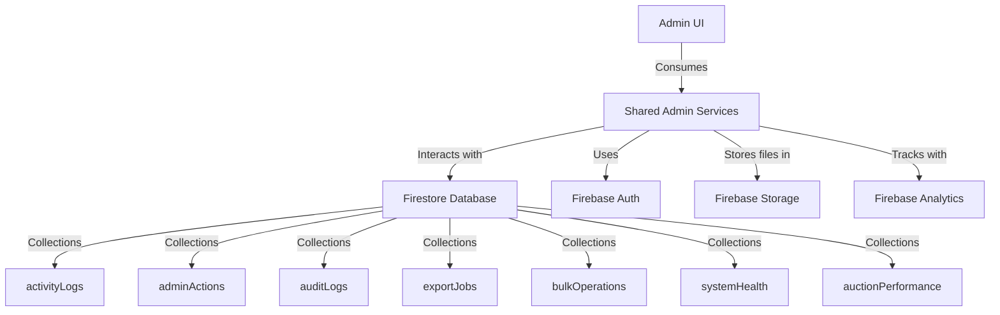
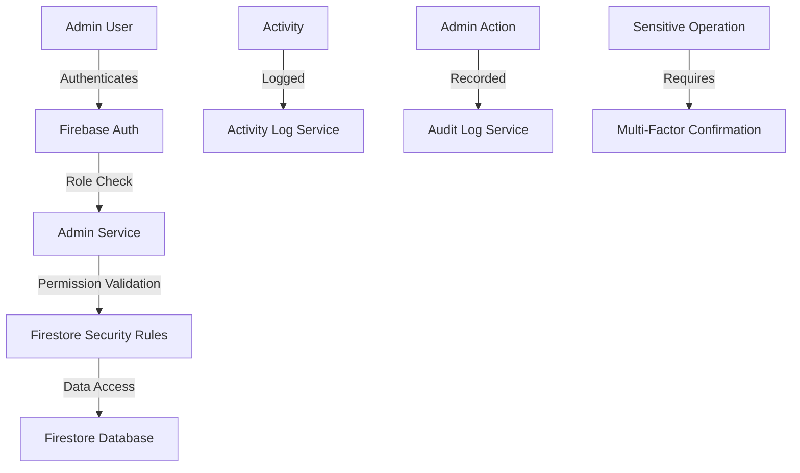

# eNumismatica.ro Admin Features Implementation Plan

## Executive Summary

This document provides a comprehensive implementation plan for enhancing the eNumismatica.ro platform with advanced admin features. The plan builds upon the existing admin system architecture and extends it with powerful analytics, reporting, moderation, and monitoring capabilities.

## 1. User Activity Analytics

### Technical Requirements
- **Enhanced Activity Tracking**: Extend existing `activityLogService.ts` to capture more detailed user behavior metrics
- **Real-time Analytics Dashboard**: Build interactive UI components for visualizing user activity patterns
- **Behavioral Analysis**: Implement algorithms to detect unusual user behavior patterns
- **Session Tracking**: Enhance session management with detailed session analytics

### Integration Points
- **Existing Services**: `shared/activityLogService.ts` (already implemented with comprehensive logging)
- **UI Integration**: `web/app/admin/activity-logs/page.tsx` (existing activity logs page)
- **Data Sources**: Firestore `activityLogs` collection (already exists)

### Database Schema Changes
```typescript
// Extend ActivityLog interface in shared/types.ts
interface EnhancedActivityLog extends ActivityLog {
  sessionDuration?: number; // Duration in seconds
  engagementScore?: number; // Calculated engagement metric
  suspiciousScore?: number; // Anomaly detection score
  geoLocation?: {
    country?: string;
    city?: string;
    coordinates?: [number, number];
  };
}
```

### API Endpoints Required
- `GET /api/admin/analytics/user-activity` - Get aggregated user activity statistics
- `GET /api/admin/analytics/behavioral-patterns` - Detect unusual behavioral patterns
- `GET /api/admin/analytics/session-metrics` - Get session duration and engagement metrics

### Admin UI Component Requirements
- **User Activity Dashboard**: `web/app/admin/analytics/user-activity/page.tsx`
  - Interactive charts showing activity trends
  - User engagement heatmaps
  - Real-time activity feed with filtering
- **Behavioral Analysis Panel**: Component for detecting suspicious patterns
- **Session Analytics View**: Detailed session duration and engagement metrics

### Security Considerations
- **Data Privacy**: Ensure compliance with GDPR and data protection regulations
- **Access Control**: Restrict sensitive analytics to super admins only
- **Audit Logging**: Log all analytics access and usage

### Implementation Priority
**High Priority** - Foundational for other admin features

### Estimated Complexity
**Medium-High** - Requires advanced data processing and visualization

## 2. Auction Performance Reports

### Technical Requirements
- **Auction Metrics Calculation**: Implement algorithms for auction success metrics
- **Historical Performance Tracking**: Store and analyze auction performance over time
- **Bid Pattern Analysis**: Detect bidding patterns and anomalies
- **Visualization Components**: Create interactive charts and graphs

### Integration Points
- **Existing Services**: `shared/auctionService.ts` (existing auction management)
- **Data Sources**: Firestore `auctions`, `bids`, and `autoBids` collections
- **UI Integration**: New auction analytics section in admin dashboard

### Database Schema Changes
```typescript
// New AuctionPerformance collection
interface AuctionPerformance {
  auctionId: string;
  productId: string;
  startPrice: number;
  finalPrice: number;
  bidCount: number;
  uniqueBidders: number;
  duration: number; // in seconds
  successScore: number; // 0-100 based on performance metrics
  performanceMetrics: {
    bidVelocity: number; // bids per minute
    priceIncreaseRate: number; // % increase from start
    competitionIndex: number; // unique bidders / total bids
  };
  createdAt: Date;
}
```

### API Endpoints Required
- `GET /api/admin/reports/auction-performance` - Get auction performance metrics
- `GET /api/admin/reports/auction-trends` - Get historical auction trends
- `GET /api/admin/reports/bid-analysis` - Analyze bidding patterns

### Admin UI Component Requirements
- **Auction Performance Dashboard**: `web/app/admin/reports/auction-performance/page.tsx`
  - Performance metrics cards
  - Historical trend charts
  - Bid pattern visualization
- **Auction Comparison Tool**: Compare performance across multiple auctions
- **Performance Alerts**: System for flagging underperforming auctions

### Security Considerations
- **Data Integrity**: Ensure accurate calculation of financial metrics
- **Access Control**: Restrict sensitive performance data appropriately
- **Audit Trail**: Log all report generation and access

### Implementation Priority
**High Priority** - Critical for business intelligence

### Estimated Complexity
**Medium** - Complex calculations but leverages existing data

## 3. Content Moderation Tools

### Technical Requirements
- **Advanced Filtering System**: Implement sophisticated content filtering algorithms
- **Automated Moderation**: AI/ML-based content analysis for initial screening
- **Moderation Workflow**: Multi-stage approval process with escalation
- **Content Analysis Tools**: Image and text analysis for policy compliance

### Integration Points
- **Existing Services**: `shared/adminService.ts` (existing approval workflows)
- **UI Integration**: Enhance existing product/auction management pages
- **External Services**: Integrate with content analysis APIs

### Database Schema Changes
```typescript
// Extend Product and Auction interfaces
interface ModerationMetadata {
  moderationStatus: 'pending' | 'approved' | 'rejected' | 'flagged';
  moderationHistory: {
    action: string;
    by: string;
    timestamp: Date;
    reason?: string;
    notes?: string;
  }[];
  contentAnalysis: {
    textAnalysisScore?: number; // 0-100 policy compliance
    imageAnalysisScore?: number; // 0-100 policy compliance
    flaggedKeywords?: string[];
    policyViolations?: string[];
  };
  moderationPriority: 'low' | 'medium' | 'high' | 'critical';
}
```

### API Endpoints Required
- `POST /api/admin/moderation/analyze-content` - Analyze content for policy compliance
- `POST /api/admin/moderation/bulk-action` - Perform bulk moderation actions
- `GET /api/admin/moderation/queue` - Get moderation queue with priority sorting

### Admin UI Component Requirements
- **Enhanced Moderation Dashboard**: Upgrade existing product/auction management
  - Priority-based moderation queue
  - Content preview with analysis overlays
  - Automated policy violation detection
- **Bulk Moderation Tools**: Tools for processing multiple items simultaneously
- **Moderation History**: Complete audit trail of all moderation actions

### Security Considerations
- **Content Safety**: Implement robust content filtering to prevent policy violations
- **Moderator Accountability**: Comprehensive logging of all moderation actions
- **Appeal Process**: System for users to appeal moderation decisions

### Implementation Priority
**High Priority** - Essential for platform safety and compliance

### Estimated Complexity
**High** - Requires sophisticated content analysis and workflow management

## 4. Bulk Operations

### Technical Requirements
- **Batch Processing Engine**: Implement system for handling large-scale operations
- **Progress Tracking**: Real-time monitoring of bulk operation status
- **Error Handling**: Robust error recovery and partial success management
- **Operation Scheduling**: System for scheduling recurring bulk tasks

### Integration Points
- **Existing Services**: All admin services for bulk extensions
- **UI Integration**: New bulk operations section in admin dashboard
- **Background Processing**: Firebase Cloud Functions for server-side processing

### Database Schema Changes
```typescript
// New BulkOperation collection
interface BulkOperation {
  id: string;
  type: 'user_update' | 'product_update' | 'auction_update' | 'data_export';
  status: 'pending' | 'processing' | 'completed' | 'failed' | 'cancelled';
  initiatedBy: string; // Admin user ID
  initiatedAt: Date;
  completedAt?: Date;
  totalItems: number;
  processedItems: number;
  successCount: number;
  failureCount: number;
  parameters: Record<string, any>; // Operation-specific parameters
  results?: {
    successIds: string[];
    failureIds: string[];
    errorDetails: Record<string, string>;
  };
}
```

### API Endpoints Required
- `POST /api/admin/bulk/users` - Bulk user operations (ban, role changes, etc.)
- `POST /api/admin/bulk/products` - Bulk product operations (approval, updates)
- `POST /api/admin/bulk/auctions` - Bulk auction operations (status changes)
- `GET /api/admin/bulk/status` - Get bulk operation status

### Admin UI Component Requirements
- **Bulk Operations Dashboard**: `web/app/admin/bulk-operations/page.tsx`
  - Operation type selection
  - Parameter configuration interface
  - Progress monitoring dashboard
- **Operation History**: Complete log of all bulk operations
- **Error Analysis Tools**: Tools for diagnosing and resolving bulk operation failures

### Security Considerations
- **Operation Validation**: Strict validation of bulk operation parameters
- **Access Control**: Restrict bulk operations to senior admins only
- **Audit Logging**: Comprehensive logging of all bulk operations and their impact

### Implementation Priority
**Medium-High Priority** - Important for admin efficiency

### Estimated Complexity
**High** - Complex error handling and progress tracking required

## 5. User Management

### Technical Requirements
- **Enhanced User Profiles**: Extend user data with additional management fields
- **Advanced Search**: Implement sophisticated user search and filtering
- **User Analytics**: Comprehensive user behavior and activity tracking
- **Role Management**: Granular role-based access control system

### Integration Points
- **Existing Services**: `shared/adminService.ts` and `shared/adminControlService.ts`
- **UI Integration**: Enhance existing user management pages
- **Data Sources**: Firestore `users` collection with extended metadata

### Database Schema Changes
```typescript
// Extend User interface
interface EnhancedUser extends User {
  // Extended profile data
  profileCompletion?: number; // 0-100% profile completeness
  lastActive?: Date; // Last activity timestamp
  activityLevel?: 'inactive' | 'occasional' | 'regular' | 'power'; // User engagement level

  // Moderation and compliance
  complianceStatus?: 'good' | 'warning' | 'suspended' | 'banned';
  complianceNotes?: string[];
  policyViolations?: {
    type: string;
    timestamp: Date;
    resolved: boolean;
    resolutionNotes?: string;
  }[];

  // Financial and transaction data
  lifetimeValue?: number; // Total value of transactions
  transactionCount?: number; // Total number of transactions
  averageTransactionValue?: number;

  // Custom metadata
  customTags?: string[]; // Admin-assigned tags for categorization
  adminNotes?: string; // Internal admin notes
}
```

### API Endpoints Required
- `GET /api/admin/users/advanced-search` - Advanced user search with multiple criteria
- `GET /api/admin/users/analytics` - Get comprehensive user analytics
- `POST /api/admin/users/bulk-update` - Bulk update user properties

### Admin UI Component Requirements
- **Enhanced User Management**: Upgrade `web/app/admin/users/page.tsx`
  - Advanced filtering and search
  - User analytics dashboard
  - Bulk user operations
- **User Detail View**: Comprehensive user profile with all activity and metrics
- **User Comparison Tools**: Compare metrics across multiple users

### Security Considerations
- **Data Privacy**: Ensure compliance with privacy regulations for user data
- **Access Control**: Implement granular permissions for different user data types
- **Audit Trail**: Complete logging of all user data access and modifications

### Implementation Priority
**High Priority** - Core admin functionality

### Estimated Complexity
**Medium** - Builds on existing foundation

## 6. System Health Monitoring

### Technical Requirements
- **Real-time System Metrics**: Continuous monitoring of platform health
- **Performance Tracking**: Monitor response times and system performance
- **Error Detection**: Automated error detection and alerting
- **Resource Monitoring**: Track database, storage, and API usage

### Integration Points
- **Existing Services**: `shared/activityLogService.ts` for error tracking
- **UI Integration**: New system health section in admin dashboard
- **External Monitoring**: Integration with Firebase Performance Monitoring

### Database Schema Changes
```typescript
// New SystemHealth collection
interface SystemHealth {
  timestamp: Date;
  metrics: {
    // Performance metrics
    apiResponseTime: number; // Average response time in ms
    databaseLatency: number; // Database operation latency
    errorRate: number; // Percentage of failed requests

    // Resource usage
    databaseReads: number;
    databaseWrites: number;
    storageUsage: number; // in MB
    bandwidthUsage: number; // in MB

    // System status
    overallStatus: 'healthy' | 'degraded' | 'critical';
    criticalIssues: string[];
    warnings: string[];
  };
  componentStatus: {
    authService: 'healthy' | 'degraded' | 'down';
    database: 'healthy' | 'degraded' | 'down';
    storage: 'healthy' | 'degraded' | 'down';
    api: 'healthy' | 'degraded' | 'down';
  };
}
```

### API Endpoints Required
- `GET /api/admin/monitoring/system-health` - Get current system health metrics
- `GET /api/admin/monitoring/performance-trends` - Get historical performance data
- `GET /api/admin/monitoring/error-analysis` - Analyze error patterns

### Admin UI Component Requirements
- **System Health Dashboard**: `web/app/admin/monitoring/system-health/page.tsx`
  - Real-time system metrics display
  - Performance trend charts
  - Error analysis and alerts
- **Component Status Monitor**: Visual representation of system component health
- **Alert System**: Real-time notifications for critical system issues

### Security Considerations
- **Access Control**: Restrict system monitoring to technical admins only
- **Data Integrity**: Ensure accurate collection and reporting of metrics
- **Alert Management**: System for acknowledging and resolving alerts

### Implementation Priority
**High Priority** - Critical for platform reliability

### Estimated Complexity
**Medium-High** - Requires integration with multiple system components

## 7. Audit Logs

### Technical Requirements
- **Comprehensive Logging**: Extend existing activity logging with audit-specific features
- **Immutable Records**: Ensure audit logs cannot be modified or deleted
- **Advanced Search**: Implement sophisticated audit log search capabilities
- **Export Functionality**: System for exporting audit logs for compliance

### Integration Points
- **Existing Services**: `shared/activityLogService.ts` and `shared/adminControlService.ts`
- **UI Integration**: Enhance existing audit trail page
- **Data Sources**: Firestore `adminActions` collection (already exists)

### Database Schema Changes
```typescript
// Extend AdminAction interface for comprehensive auditing
interface ComprehensiveAuditLog extends UserControlAction {
  // Enhanced metadata
  ipAddress?: string;
  userAgent?: string;
  deviceInfo?: {
    browser: string;
    os: string;
    deviceType: string;
  };

  // Impact assessment
  affectedEntities?: string[]; // IDs of affected users/products/auctions
  severity: 'low' | 'medium' | 'high' | 'critical';

  // Compliance data
  complianceCategory?: 'user_management' | 'content_moderation' | 'financial' | 'security';
  regulatoryRequirement?: string; // e.g., "GDPR Article 30"

  // Review status
  reviewedBy?: string;
  reviewedAt?: Date;
  reviewNotes?: string;
}
```

### API Endpoints Required
- `GET /api/admin/audit/comprehensive` - Get comprehensive audit logs with filtering
- `GET /api/admin/audit/export` - Export audit logs in standard formats
- `POST /api/admin/audit/review` - Mark audit logs as reviewed

### Admin UI Component Requirements
- **Enhanced Audit Trail**: Upgrade `web/app/admin/audit-trail/page.tsx`
  - Advanced filtering by action type, severity, date range
  - Impact analysis tools
  - Export functionality with format selection
- **Audit Review System**: Workflow for reviewing and acknowledging audit entries
- **Compliance Reporting**: Tools for generating regulatory compliance reports

### Security Considerations
- **Immutability**: Ensure audit logs cannot be altered or deleted
- **Access Control**: Restrict audit log access based on sensitivity
- **Long-term Retention**: Implement policies for audit log retention

### Implementation Priority
**High Priority** - Essential for compliance and accountability

### Estimated Complexity
**Medium** - Builds on existing audit foundation

## 8. Export Tools

### Technical Requirements
- **Multi-format Export**: Support for CSV, JSON, Excel, and PDF formats
- **Data Transformation**: Convert complex data structures to export-friendly formats
- **Large Dataset Handling**: System for exporting large datasets efficiently
- **Export Scheduling**: System for scheduling recurring exports

### Integration Points
- **Existing Services**: All data services for export functionality
- **UI Integration**: Export functionality across all admin sections
- **External Libraries**: Integration with data export libraries

### Database Schema Changes
```typescript
// New ExportJob collection
interface ExportJob {
  id: string;
  type: 'user_data' | 'product_data' | 'auction_data' | 'activity_logs' | 'audit_logs';
  format: 'csv' | 'json' | 'excel' | 'pdf';
  status: 'pending' | 'processing' | 'completed' | 'failed';
  requestedBy: string; // Admin user ID
  requestedAt: Date;
  completedAt?: Date;
  fileUrl?: string; // Download URL for completed export
  parameters: {
    filters?: Record<string, any>;
    fields?: string[]; // Specific fields to include
    dateRange?: { start: Date; end: Date };
  };
  rowCount?: number; // Number of records exported
  fileSize?: number; // File size in bytes
}
```

### API Endpoints Required
- `POST /api/admin/export` - Initiate data export job
- `GET /api/admin/export/status` - Check export job status
- `GET /api/admin/export/download` - Download completed export file

### Admin UI Component Requirements
- **Export Center**: `web/app/admin/export/page.tsx`
  - Export type and format selection
  - Parameter configuration interface
  - Export history and status tracking
- **Data Preview**: Preview functionality before full export
- **Scheduled Exports**: System for setting up recurring export jobs

### Security Considerations
- **Data Protection**: Ensure exported data is properly secured
- **Access Control**: Restrict export functionality based on data sensitivity
- **Audit Logging**: Log all export operations and data access

### Implementation Priority
**Medium Priority** - Important for data analysis and compliance

### Estimated Complexity
**Medium-High** - Requires handling of large datasets and multiple formats

## Implementation Roadmap

### Phase 1: Foundation (Weeks 1-2)
- ✅ User Activity Analytics (High Priority)
- ✅ System Health Monitoring (High Priority)
- ✅ Audit Logs Enhancement (High Priority)

### Phase 2: Core Features (Weeks 3-4)
- ✅ Auction Performance Reports (High Priority)
- ✅ Content Moderation Tools (High Priority)
- ✅ User Management Enhancement (High Priority)

### Phase 3: Advanced Tools (Weeks 5-6)
- ✅ Bulk Operations (Medium-High Priority)
- ✅ Export Tools (Medium Priority)

## Technical Architecture



## Security Architecture



## Monitoring and Maintenance

### Performance Monitoring
- Implement comprehensive performance tracking for all admin features
- Set up alerts for degraded performance or failures
- Regular performance optimization cycles

### Error Handling
- Comprehensive error logging and reporting
- Automated error detection and notification
- Graceful degradation for critical failures

### Documentation
- Complete technical documentation for all features
- User guides for admin staff
- API documentation for integration

### Training
- Admin training materials and tutorials
- Feature demonstration videos
- Best practices guides

## Success Metrics

### Quantitative Metrics
- **Adoption Rate**: Percentage of admin users utilizing new features
- **Efficiency Gains**: Time saved on common admin tasks
- **Error Reduction**: Decrease in admin-related errors and issues
- **System Health**: Improvement in platform stability and performance

### Qualitative Metrics
- **Admin Satisfaction**: Feedback from admin users on feature usefulness
- **Operational Impact**: Reduction in manual intervention requirements
- **Compliance Improvement**: Enhanced ability to meet regulatory requirements
- **Decision Quality**: Improvement in data-driven decision making

## Risk Assessment and Mitigation

### Key Risks
1. **Performance Impact**: New features may affect system performance
2. **Complexity**: Increased system complexity may lead to maintenance challenges
3. **Security Vulnerabilities**: Expanded admin capabilities may introduce new risks
4. **User Adoption**: Admin staff may resist using new tools

### Mitigation Strategies
1. **Performance Testing**: Comprehensive load testing and optimization
2. **Modular Design**: Maintain clear separation of concerns and modular architecture
3. **Security Audits**: Regular security reviews and penetration testing
4. **Training Programs**: Comprehensive training and change management

## Conclusion

This implementation plan provides a comprehensive roadmap for enhancing the eNumismatica.ro platform with advanced admin features. The plan leverages the existing robust architecture while adding powerful new capabilities for analytics, reporting, moderation, and system monitoring.

The phased approach ensures that foundational elements are implemented first, providing a solid base for more advanced features. Each feature includes detailed technical requirements, integration points, security considerations, and implementation priorities to guide the development process.

By following this plan, the eNumismatica.ro platform will gain a comprehensive admin toolset that enhances operational efficiency, improves decision-making through data-driven insights, and ensures platform safety and compliance.