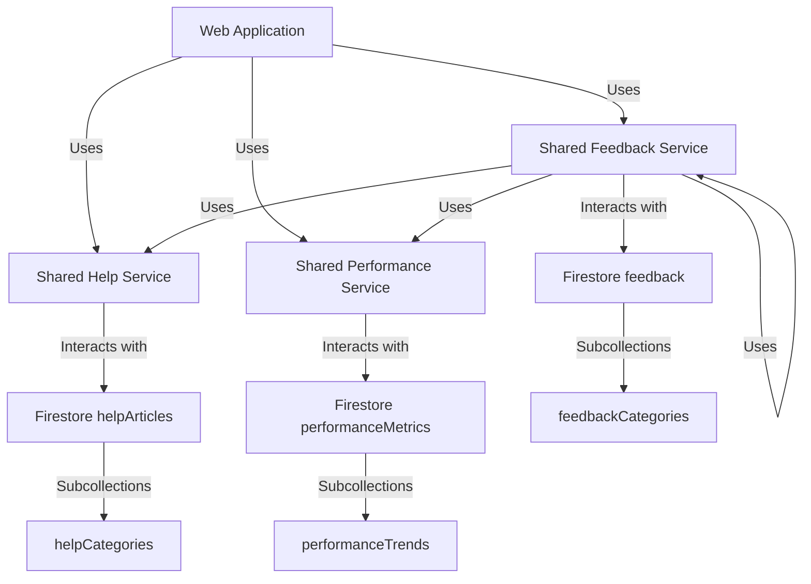
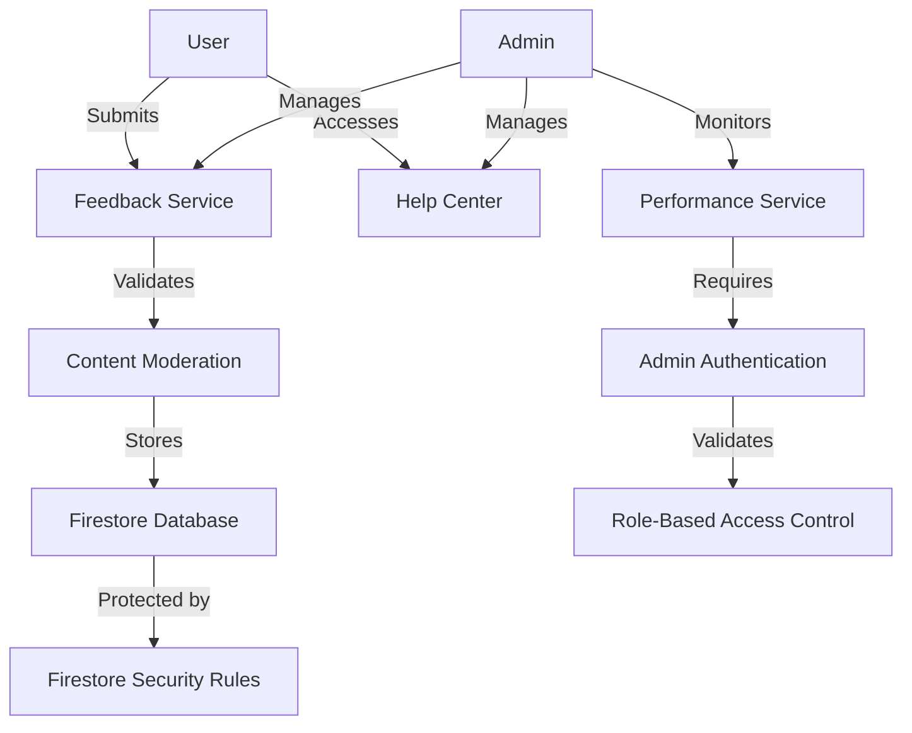

# eNumismatica.ro Shared Features Implementation Plan

## Executive Summary

This document provides a comprehensive implementation plan for three critical shared features that will enhance both user and admin experiences across the eNumismatica.ro platform: Help Center, Feedback System, and Performance Optimizations. These features will be implemented as shared services that work seamlessly across both web and mobile platforms.

## 1. Help Center

### Technical Requirements

- **Knowledge Base System**: Comprehensive FAQ and help article management
- **Contextual Help**: In-app help that adapts to user context and current activity
- **Search Functionality**: Advanced search with natural language processing
- **Multi-language Support**: Support for Romanian and English content
- **Help Article Management**: Admin interface for creating, editing, and organizing help content
- **User Feedback on Help Content**: System for users to rate help articles

### Integration Points

- **Existing Services**: Integrate with existing `shared/auth.ts` for user context
- **UI Integration**: Both web and mobile navigation systems
- **Data Sources**: New Firestore `helpArticles` and `helpCategories` collections
- **Admin Integration**: Admin dashboard for content management

### Database Schema Changes

```typescript
// New HelpArticle collection
interface HelpArticle {
  id: string;
  title: string;
  content: string;
  categoryId: string;
  language: 'ro' | 'en';
  tags: string[];
  createdAt: Date;
  updatedAt: Date;
  createdBy: string; // Admin user ID
  views: number;
  helpfulCount: number;
  notHelpfulCount: number;
  status: 'draft' | 'published' | 'archived';
  version: number;
}

// New HelpCategory collection
interface HelpCategory {
  id: string;
  name: string;
  description: string;
  order: number;
  parentCategoryId?: string;
  icon?: string;
  language: 'ro' | 'en';
}

// Extend User interface for help preferences
interface UserHelpPreferences {
  preferredLanguage: 'ro' | 'en';
  viewedArticles: string[]; // Article IDs
  helpfulRatings: Record<string, 'helpful' | 'not_helpful'>;
}
```

### API Endpoints Required

- `GET /api/help/articles` - Get help articles with filtering
- `GET /api/help/articles/:id` - Get specific help article
- `GET /api/help/categories` - Get help categories
- `POST /api/help/search` - Search help content
- `POST /api/help/feedback` - Submit feedback on help article
- `GET /api/help/popular` - Get most viewed/helpful articles

### UI Component Requirements

#### Web Components
- **Help Center Page**: `web/app/help/page.tsx`
  - Category navigation
  - Article listing
  - Search functionality
- **Article View**: `web/app/help/[id]/page.tsx`
  - Rich content display
  - Feedback buttons
  - Related articles
- **Contextual Help Widget**: Reusable component for in-app help
- **Admin Help Management**: `web/app/admin/help/page.tsx`
  - Article editor with rich text
  - Category management
  - Analytics dashboard

#### Mobile Components
- **Help Center Screen**: `mobile/screens/HelpCenterScreen.tsx`
  - Mobile-optimized article browsing
  - Offline content caching
- **Help Article Screen**: `mobile/screens/HelpArticleScreen.tsx`
  - Readable content display
  - Feedback interface
- **Contextual Help Modal**: Modal component for in-app assistance

### Cross-Platform Considerations

- **Responsive Design**: Ensure help content displays well on all screen sizes
- **Offline Access**: Cache help articles for mobile offline use
- **Platform-Specific UI**: Adapt navigation patterns to platform conventions
- **Consistent Content**: Same help content available on both platforms
- **Unified Search**: Same search results across platforms

### Security Considerations

- **Content Moderation**: Admin approval workflow for new articles
- **Access Control**: Role-based access to help management
- **Data Validation**: Sanitize help content to prevent XSS
- **Audit Logging**: Track all help content changes
- **Rate Limiting**: Prevent abuse of search/feedback systems

### Implementation Priority

**High Priority** - Critical for user support and platform usability

### Estimated Complexity

**Medium** - Requires content management system and search functionality

## 2. Feedback System

### Technical Requirements

- **Multi-Channel Feedback**: Collect feedback from various touchpoints
- **Feedback Categorization**: Organize feedback by type and priority
- **Sentiment Analysis**: Basic sentiment analysis for feedback content
- **Response Tracking**: System for tracking admin responses to feedback
- **Feedback Analytics**: Dashboard for analyzing feedback trends
- **User Feedback History**: Track individual user feedback submissions

### Integration Points

- **Existing Services**: Integrate with `shared/auth.ts` and `shared/adminService.ts`
- **UI Integration**: Feedback buttons across all user interfaces
- **Data Sources**: New Firestore `feedback` and `feedbackCategories` collections
- **Notification Integration**: Connect with existing notification system

### Database Schema Changes

```typescript
// New Feedback collection
interface Feedback {
  id: string;
  userId: string;
  userEmail: string;
  userName: string;
  content: string;
  categoryId: string;
  sentimentScore: number; // -1 to 1 scale
  status: 'new' | 'reviewed' | 'in_progress' | 'resolved' | 'rejected';
  priority: 'low' | 'medium' | 'high' | 'critical';
  createdAt: Date;
  updatedAt: Date;
  resolvedAt?: Date;
  resolvedBy?: string;
  response?: string;
  metadata: {
    pageUrl?: string;
    userAgent?: string;
    deviceInfo?: string;
    screenshotUrl?: string;
  };
  tags: string[];
}

// New FeedbackCategory collection
interface FeedbackCategory {
  id: string;
  name: string;
  description: string;
  order: number;
  icon?: string;
  defaultPriority: 'low' | 'medium' | 'high';
}

// Extend User interface for feedback tracking
interface UserFeedback {
  feedbackSubmitted: number;
  lastFeedbackDate: Date;
  feedbackResponseRate: number; // % of feedback that received responses
}
```

### API Endpoints Required

- `POST /api/feedback/submit` - Submit new feedback
- `GET /api/feedback/categories` - Get feedback categories
- `GET /api/admin/feedback` - Get feedback list (admin only)
- `POST /api/admin/feedback/respond` - Admin responds to feedback
- `POST /api/admin/feedback/status` - Update feedback status
- `GET /api/admin/feedback/analytics` - Get feedback analytics
- `POST /api/feedback/upload` - Upload screenshot/attachment

### UI Component Requirements

#### Web Components
- **Feedback Button**: Reusable component for all pages
- **Feedback Form**: Modal/dialog for submitting feedback
- **Feedback Confirmation**: Thank you page/notification
- **Admin Feedback Dashboard**: `web/app/admin/feedback/page.tsx`
  - Feedback listing with filters
  - Response interface
  - Analytics charts
- **User Feedback History**: Section in user profile

#### Mobile Components
- **Feedback Button**: Floating action button for easy access
- **Feedback Form Screen**: `mobile/screens/FeedbackScreen.tsx`
  - Mobile-optimized form
  - Camera integration for screenshots
- **Feedback History**: Section in mobile profile
- **Admin Feedback Management**: Mobile admin interface

### Cross-Platform Considerations

- **Consistent Feedback Collection**: Same categories and process across platforms
- **Platform-Specific Input**: Adapt form inputs to platform capabilities
- **Unified Analytics**: Combined feedback data for analysis
- **Responsive Design**: Ensure admin interface works on mobile devices
- **Offline Submission**: Queue feedback for submission when offline

### Security Considerations

- **Spam Prevention**: Rate limiting and duplicate detection
- **Content Moderation**: Automated filtering of inappropriate content
- **Data Privacy**: Handle personal information appropriately
- **Access Control**: Restrict feedback management to authorized admins
- **Audit Trail**: Track all feedback responses and status changes

### Implementation Priority

**High Priority** - Essential for user engagement and platform improvement

### Estimated Complexity

**Medium-High** - Requires sentiment analysis and comprehensive admin tools

## 3. Performance Optimizations

### Technical Requirements

- **Query Optimization**: Analyze and optimize Firestore queries
- **Caching Strategy**: Implement intelligent caching mechanisms
- **Lazy Loading**: Enhance lazy loading for images and components
- **Bundle Optimization**: Reduce bundle sizes for faster loading
- **Performance Monitoring**: Real-time performance tracking
- **Automated Optimization**: System for continuous performance improvement

### Integration Points

- **Existing Services**: All shared services for optimization
- **UI Integration**: All components for performance enhancements
- **Data Sources**: Performance metrics in Firestore
- **Build Process**: Integration with build pipelines

### Database Schema Changes

```typescript
// New PerformanceMetric collection
interface PerformanceMetric {
  id: string;
  timestamp: Date;
  pageUrl: string;
  platform: 'web' | 'mobile';
  metrics: {
    loadTime: number; // in ms
    firstContentfulPaint: number;
    timeToInteractive: number;
    bundleSize: number; // in KB
    apiResponseTime: number;
    databaseLatency: number;
  };
  userId?: string;
  deviceInfo?: {
    browser?: string;
    os?: string;
    deviceType?: string;
    connectionType?: string;
  };
  performanceScore: number; // 0-100 scale
}

// Extend existing collections with performance data
interface CachedData {
  cacheKey: string;
  data: any;
  expiresAt: Date;
  lastAccessed: Date;
  accessCount: number;
  cacheStrategy: 'short' | 'medium' | 'long' | 'permanent';
}
```

### API Endpoints Required

- `POST /api/performance/metrics` - Submit performance metrics
- `GET /api/admin/performance` - Get performance dashboard data
- `POST /api/admin/performance/optimize` - Trigger optimization tasks
- `GET /api/admin/performance/trends` - Get historical performance trends
- `POST /api/cache/invalidate` - Invalidate specific cache entries

### Technical Implementation Requirements

#### Query Optimization
- **Index Analysis**: Review and add Firestore indexes
- **Query Batching**: Implement batching for large data operations
- **Selective Loading**: Load only necessary fields for each view
- **Pagination**: Add pagination to all data-heavy interfaces

#### Caching Strategy
- **Client-Side Caching**: Implement React Query or similar
- **Server-Side Caching**: Add caching layer for API responses
- **Data Pre-fetching**: Pre-load data for likely next actions
- **Cache Invalidation**: Smart cache invalidation system

#### Lazy Loading Enhancements
- **Image Optimization**: Implement next-gen image formats
- **Component Chunking**: Code splitting for large components
- **Deferred Loading**: Load non-critical components after main content
- **Intersection Observer**: Use for smart loading triggers

#### Bundle Optimization
- **Tree Shaking**: Ensure proper tree shaking configuration
- **Code Splitting**: Implement dynamic imports
- **Dependency Analysis**: Remove unused dependencies
- **Bundle Analysis**: Regular bundle size monitoring

### UI Component Requirements

#### Web Components
- **Performance Monitoring Component**: Track and report metrics
- **Loading States**: Enhanced loading indicators
- **Error Boundaries**: Improved error handling UIs
- **Admin Performance Dashboard**: `web/app/admin/performance/page.tsx`
  - Real-time performance metrics
  - Historical trend analysis
  - Optimization recommendations

#### Mobile Components
- **Performance Monitoring**: Mobile-specific metrics tracking
- **Offline Indicators**: Clear offline/online status
- **Optimized Navigation**: Smooth transitions between screens
- **Admin Performance View**: Mobile admin performance monitoring

### Cross-Platform Considerations

- **Consistent Performance**: Ensure similar performance across platforms
- **Platform-Specific Optimizations**: Tailor optimizations to each platform
- **Unified Monitoring**: Combined performance data collection
- **Adaptive Strategies**: Different optimization approaches per platform

### Security Considerations

- **Performance Data Privacy**: Anonymize user-specific performance data
- **Access Control**: Restrict performance tools to technical admins
- **Data Integrity**: Ensure accurate performance metric collection
- **Rate Limiting**: Prevent abuse of performance monitoring endpoints

### Implementation Priority

**Critical Priority** - Directly impacts user experience and platform success

### Estimated Complexity

**High** - Requires comprehensive analysis and ongoing optimization

## Implementation Roadmap

### Phase 1: Foundation (Weeks 1-2)
- [ ] Help Center - Core content management system
- [ ] Feedback System - Basic feedback collection
- [ ] Performance Optimizations - Initial monitoring setup

### Phase 2: Core Features (Weeks 3-4)
- [ ] Help Center - Advanced search and contextual help
- [ ] Feedback System - Admin dashboard and analytics
- [ ] Performance Optimizations - Query and caching improvements

### Phase 3: Advanced Features (Weeks 5-6)
- [ ] Help Center - Multi-language support and user feedback
- [ ] Feedback System - Sentiment analysis and response tracking
- [ ] Performance Optimizations - Bundle optimization and lazy loading

## Technical Architecture



## Security Architecture



## Monitoring and Maintenance

### Performance Monitoring
- Implement comprehensive tracking for all shared features
- Set up alerts for degraded performance
- Regular optimization review cycles

### Error Handling
- Comprehensive error logging for all features
- Automated error detection and notification
- Graceful degradation for critical failures

### Documentation
- Complete technical documentation for all features
- User guides for help center usage
- Admin documentation for feedback management

### Training
- Admin training on feedback system usage
- Help center content creation guidelines
- Performance optimization best practices

## Success Metrics

### Quantitative Metrics
- **Help Center Usage**: Number of help articles viewed per user
- **Feedback Volume**: Number of feedback submissions
- **Response Time**: Average time to respond to feedback
- **Performance Improvement**: Percentage improvement in key metrics

### Qualitative Metrics
- **User Satisfaction**: Feedback ratings on help content
- **Issue Resolution**: Percentage of feedback leading to improvements
- **Platform Stability**: Reduction in performance-related issues
- **Admin Efficiency**: Time saved in support operations

## Risk Assessment and Mitigation

### Key Risks
1. **Performance Impact**: New features may affect system performance
2. **Content Quality**: Help center content may be inconsistent
3. **Feedback Overload**: High volume of feedback may overwhelm admins
4. **Cross-Platform Inconsistencies**: Different behavior across platforms

### Mitigation Strategies
1. **Performance Testing**: Comprehensive load testing
2. **Content Guidelines**: Clear content creation standards
3. **Feedback Triage**: Automated categorization and prioritization
4. **Platform Testing**: Extensive cross-platform testing

## Conclusion

This implementation plan provides a comprehensive roadmap for adding three critical shared features to the eNumismatica.ro platform. The Help Center will significantly improve user support and reduce support burden, the Feedback System will create a direct channel for user input and platform improvement, and the Performance Optimizations will ensure the platform remains fast and responsive as it grows.

By following this plan, the eNumismatica.ro platform will gain powerful shared capabilities that enhance both user and admin experiences while maintaining the platform's architectural integrity and cross-platform consistency.