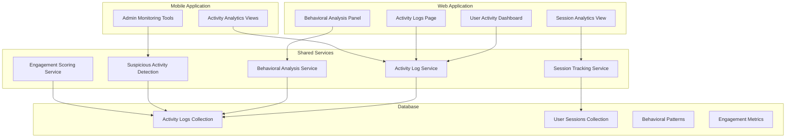
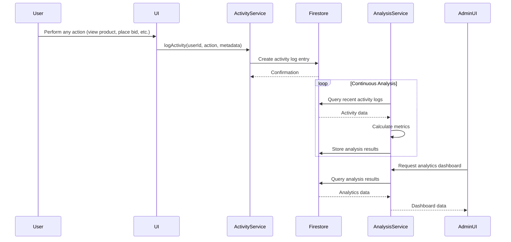

# User Activity Analytics Documentation

## Table of Contents

1. [Feature Overview](#feature-overview)
2. [Technical Architecture](#technical-architecture)
3. [API Documentation](#api-documentation)
4. [Database Schema](#database-schema)
5. [User Guide](#user-guide)
6. [Admin Guide](#admin-guide)
7. [Integration Points](#integration-points)
8. [Troubleshooting](#troubleshooting)
9. [Security Considerations](#security-considerations)
10. [Performance Optimization](#performance-optimization)

## Feature Overview

### Purpose

The User Activity Analytics feature provides comprehensive tracking and analysis of user behavior, engagement patterns, and platform usage. This system enables administrators to understand user interactions, detect behavioral patterns, and monitor platform health.

### Key Features

- **Comprehensive Activity Logging**: Tracks all user actions across the platform
- **Behavioral Pattern Detection**: Identifies common user behavior patterns
- **Engagement Scoring**: Calculates user engagement levels
- **Session Analytics**: Monitors user sessions and activity patterns
- **Suspicious Activity Detection**: Flags potentially fraudulent or abusive behavior
- **Real-time Monitoring**: Provides up-to-date analytics for immediate insights

### Business Value

- **User Insights**: Deep understanding of how users interact with the platform
- **Platform Optimization**: Data-driven decisions for feature improvements
- **Fraud Prevention**: Early detection of suspicious or malicious activity
- **Personalization**: Foundation for personalized user experiences
- **Performance Monitoring**: Track platform usage and identify bottlenecks

## Technical Architecture

### Component Diagram



### Data Flow



### Service Implementation

The activity analytics service is implemented in `shared/activityLogService.ts` with comprehensive functionality:

```typescript
// Activity logging
export async function logActivity(
  userId: string,
  action: string,
  metadata?: ActivityLogMetadata,
  ipAddress?: string,
  userAgent?: string
): Promise<{ success: boolean; error?: string; activityId?: string }>

// Activity retrieval
export async function getActivityLogs(
  filter?: ActivityLogFilter
): Promise<{ success: boolean; error?: string; logs?: ActivityLog[] }>

// User-specific analytics
export async function getUserActivityAnalytics(
  userId: string
): Promise<UserActivityAnalytics>

// Behavioral pattern detection
export async function detectBehavioralPatterns(): Promise<BehavioralPatternsResult>

// Engagement scoring
export function calculateEngagementScore(logs: ActivityLog[]): number

// Suspicious activity detection
export function calculateSuspiciousScore(logs: ActivityLog[]): number
```

## API Documentation

### Base Endpoints

All analytics API endpoints are prefixed with `/api/admin/analytics/`

### Authentication

All endpoints require Firebase authentication and admin privileges.

### Endpoints

#### GET /api/admin/analytics/user-activity

**Description**: Get comprehensive activity analytics for a specific user

**Parameters**:
- `userId` (required): User ID to analyze

**Response**:
```json
{
  "success": true,
  "data": {
    "userId": "user_id",
    "totalSessions": 42,
    "averageSessionDuration": 12.5,
    "engagementScore": 87,
    "behavioralPatterns": {
      "frequentActions": ["view_product", "place_bid", "search"],
      "timeOfDayActivity": {
        "morning": 0.3,
        "afternoon": 0.5,
        "evening": 0.2
      },
      "deviceUsage": {
        "web": 0.6,
        "mobile": 0.4
      }
    },
    "suspiciousActivityScore": 0.15,
    "recentActivity": [
      {
        "timestamp": "2023-12-01T10:30:00Z",
        "action": "view_product",
        "metadata": {
          "productId": "prod_123",
          "referrer": "/auctions"
        }
      }
    ],
    "sessionMetrics": {
      "currentActiveSessions": 1,
      "averageSessionLength": "12m 34s",
      "sessionFrequency": "daily"
    }
  }
}
```

#### GET /api/admin/analytics/behavioral-patterns

**Description**: Get aggregated behavioral patterns across all users

**Parameters**: None

**Response**:
```json
{
  "success": true,
  "patterns": {
    "commonActionSequences": [
      ["view_product", "add_to_watchlist"],
      ["view_auction", "place_bid"],
      ["search", "view_product"]
    ],
    "timeBasedPatterns": {
      "peakActivityHours": ["14:00", "20:00"],
      "weeklyActivityDistribution": {
        "Monday": 0.15,
        "Tuesday": 0.18,
        "Wednesday": 0.17,
        "Thursday": 0.16,
        "Friday": 0.20,
        "Saturday": 0.08,
        "Sunday": 0.06
      }
    },
    "devicePatterns": {
      "primaryDeviceUsage": {
        "desktop": 0.55,
        "mobile": 0.45
      },
      "crossDeviceUsers": 0.32
    },
    "engagementPatterns": {
      "highEngagementActions": ["place_bid", "create_auction", "contact_seller"],
      "lowEngagementActions": ["view_terms", "view_help"]
    }
  }
}
```

#### GET /api/admin/analytics/session-metrics

**Description**: Get session-related metrics and analytics

**Parameters**: None

**Response**:
```json
{
  "success": true,
  "metrics": {
    "totalSessions": 1248,
    "activeSessions": 42,
    "averageSessionDuration": "8m 22s",
    "sessionFrequency": {
      "dailyUsers": 320,
      "weeklyUsers": 845,
      "monthlyUsers": 1120
    },
    "sessionQuality": {
      "bounceRate": 0.28,
      "averageActionsPerSession": 12.4,
      "averagePagesPerSession": 4.8
    },
    "deviceDistribution": {
      "desktop": 0.55,
      "mobileWeb": 0.25,
      "mobileApp": 0.20
    },
    "geographicDistribution": {
      "Romania": 0.75,
      "EU": 0.15,
      "Other": 0.10
    }
  }
}
```

## Database Schema

### Activity Log Structure

```typescript
interface ActivityLog {
  id: string;                    // Auto-generated document ID
  userId: string;                // User who performed the action
  action: string;                // Type of action performed
  timestamp: Date;               // When the action occurred
  metadata: ActivityLogMetadata; // Additional action details
  ipAddress: string;             // User's IP address
  userAgent: string;             // User's browser/device info
  sessionId: string;             // Current user session ID
}

interface ActivityLogMetadata {
  productId?: string;           // Related product ID
  auctionId?: string;            // Related auction ID
  bidAmount?: number;            // Bid amount if applicable
  searchQuery?: string;          // Search term if applicable
  pageUrl?: string;              // Page URL where action occurred
  deviceInfo?: {                 // Detailed device information
    browser: string;
    os: string;
    device: string;
  };
  referrer?: string;             // Referring page URL
  duration?: number;             // Action duration in milliseconds
}
```

### User Activity Analytics Structure

```typescript
interface UserActivityAnalytics {
  userId: string;
  totalSessions: number;
  averageSessionDuration: number; // in minutes
  engagementScore: number;       // 0-100 scale
  behavioralPatterns: {
    frequentActions: string[];
    timeOfDayActivity: {
      morning: number;    // 0-1 proportion
      afternoon: number;  // 0-1 proportion
      evening: number;    // 0-1 proportion
    };
    deviceUsage: {
      web: number;        // 0-1 proportion
      mobile: number;    // 0-1 proportion
    };
  };
  suspiciousActivityScore: number; // 0-1 scale (higher = more suspicious)
  recentActivity: ActivityLog[];
  sessionMetrics: {
    currentActiveSessions: number;
    averageSessionLength: string;
    sessionFrequency: string;
  };
}
```

### Firestore Structure

```
activityLogs/
  {activityLogId}/
    - userId: string
    - action: string
    - timestamp: timestamp
    - metadata: map
    - ipAddress: string
    - userAgent: string
    - sessionId: string

userSessions/
  {sessionId}/
    - userId: string
    - startTime: timestamp
    - endTime: timestamp
    - duration: number
    - actions: array
    - deviceInfo: map
    - location: map

behavioralPatterns/
  {patternId}/
    - patternType: string
    - frequency: number
    - users: array
    - lastDetected: timestamp
```

### Security Rules

```javascript
// Firestore security rules for activity analytics
match /activityLogs/{logId} {
  allow read: if request.auth != null && isAdmin();
  allow write: if request.auth != null && isAuthenticated();
}

match /userSessions/{sessionId} {
  allow read: if request.auth != null && (
    request.auth.uid == resource.data.userId ||
    isAdmin()
  );
  allow write: if request.auth != null && request.auth.uid == resource.data.userId;
}

function isAdmin() {
  return isAuthenticated() &&
         (get(/databases/$(database)/documents/users/$(request.auth.uid)).data.role == 'admin' ||
          get(/databases/$(database)/documents/users/$(request.auth.uid)).data.email == 'sorinp3g@gmail.com');
}
```

## User Guide

### Understanding Activity Tracking

#### What Gets Tracked
- All major user actions (views, bids, searches, etc.)
- Session information (duration, frequency)
- Device and location data (anonymized)
- Engagement patterns and behavior

#### Privacy Information
- Activity data is used for platform improvement only
- Personal information is protected and anonymized
- Users can request their activity data be deleted
- All tracking complies with GDPR regulations

### Viewing Your Activity (User Perspective)

#### Accessing Your Activity History
1. Log in to your eNumismatica.ro account
2. Navigate to your profile or account settings
3. View your recent activity and session history
4. See your engagement score and behavior patterns

#### Understanding Your Analytics
- **Engagement Score**: Measures how actively you use the platform
- **Behavior Patterns**: Shows your typical usage habits
- **Session Metrics**: Tracks your visit frequency and duration
- **Activity History**: Chronological record of your actions

## Admin Guide

### Accessing Analytics Dashboard

#### Navigation
1. Log in with admin credentials
2. Click "Admin" in the main navigation
3. Select "Analitice" from the admin menu
4. Choose the type of analytics to view

#### Dashboard Overview
- **User Activity Analytics**: Individual user behavior analysis
- **Behavioral Patterns**: Aggregated behavior across all users
- **Session Metrics**: Platform-wide session statistics
- **Real-time Monitoring**: Current active users and sessions

### Monitoring User Activity

#### Individual User Analysis
1. Go to Admin → Analytics → User Activity
2. Search for a specific user by ID or email
3. View comprehensive activity analytics
4. Analyze engagement scores and behavior patterns

#### Behavioral Pattern Detection
1. Navigate to Behavioral Analysis tab
2. View common action sequences
3. Analyze time-based activity patterns
4. Examine device usage distributions

#### Session Monitoring
1. Go to Session Analytics view
2. Monitor current active sessions
3. Analyze session quality metrics
4. Track geographic and device distribution

### Advanced Analytics Features

#### Engagement Scoring
- Scores range from 0-100 (higher = more engaged)
- Based on action frequency, diversity, and duration
- Helps identify power users and at-risk users

#### Suspicious Activity Detection
- Scores range from 0-1 (higher = more suspicious)
- Flags unusual behavior patterns
- Helps prevent fraud and abuse

#### Time-Based Analysis
- Identify peak usage hours
- Understand weekly activity cycles
- Optimize platform resources accordingly

### Exporting Analytics Data

#### Data Export Options
1. Click the export button in any analytics view
2. Choose format (CSV, JSON, Excel)
3. Select time range for data export
4. Download the analytics report

#### Scheduled Reports
1. Set up automated report generation
2. Configure email delivery for regular reports
3. Customize report content and frequency

## Integration Points

### Cross-Platform Integration

#### Shared Analytics Service
- Both web and mobile use the same analytics services
- Consistent data collection across platforms
- Unified reporting and analysis

#### Platform-Specific Implementations
- **Web**: Comprehensive admin dashboard with detailed views
- **Mobile**: Simplified monitoring tools for quick insights

### Third-Party Integrations

#### Analytics Platforms
- Google Analytics integration for additional tracking
- Mixpanel for advanced behavioral analytics
- Hotjar for user session recordings

#### Monitoring Systems
- Sentry for error tracking and monitoring
- Datadog for performance monitoring
- Custom alerting for suspicious activity

## Troubleshooting

### Common Issues and Solutions

#### Analytics Data Not Updating
**Symptoms**: Dashboard shows stale or incomplete data
**Causes**:
- Firestore connection issues
- Analysis service errors
- Caching problems
- Permission issues

**Solutions**:
1. Refresh the analytics dashboard
2. Check Firestore connection status
3. Verify admin permissions
4. Restart analysis services
5. Clear cache and reload

#### Missing Activity Data
**Symptoms**: Expected user actions not appearing in logs
**Causes**:
- Client-side tracking failures
- Network connectivity issues
- Security rule rejections
- Service implementation errors

**Solutions**:
1. Verify client-side tracking implementation
2. Check network connectivity and retry failed requests
3. Review Firestore security rules
4. Test activity logging with debug tools
5. Examine service error logs

#### Performance Issues
**Symptoms**: Slow analytics dashboard loading
**Causes**:
- Large dataset queries
- Inefficient analysis algorithms
- Database indexing problems
- Network latency

**Solutions**:
1. Optimize Firestore queries with proper indexing
2. Implement query pagination and limits
3. Add server-side caching for common analytics
4. Optimize analysis algorithms
5. Monitor and scale database resources

### Debugging Tools

#### Admin Debugging Console
- View raw activity log data
- Test analysis algorithms manually
- Monitor real-time data processing

#### Database Tools
- Firestore console for direct data inspection
- Query performance analyzer
- Index management tools

#### Monitoring Dashboards
- Real-time analytics processing metrics
- Error rate monitoring
- Performance trend analysis

## Security Considerations

### Data Privacy
- Activity data contains sensitive user information
- Strict access controls for analytics data
- Anonymization of personal data in aggregate reports
- Compliance with GDPR and data protection regulations

### Access Control
- Admin-only access to comprehensive analytics
- Users can only view their own activity data
- Role-based permissions for different analytics levels
- Audit logging for all analytics access

### Data Protection
- Encryption of sensitive activity data
- Secure transmission of analytics results
- Regular security audits of analytics systems
- Anonymization techniques for reporting

### Compliance
- GDPR compliance for user data handling
- Data retention policies for activity logs
- User rights for data access and deletion
- Regular privacy impact assessments

## Performance Optimization

### Query Optimization
- **Indexing**: Proper Firestore indexes for analytics queries
- **Pagination**: Limit result sizes with pagination
- **Selective Loading**: Only load necessary fields for analysis
- **Caching**: Cache frequent analytics computations

### Analysis Optimization
- **Batch Processing**: Process activity logs in batches
- **Incremental Analysis**: Update analytics incrementally
- **Sampling**: Use statistical sampling for large datasets
- **Parallel Processing**: Distribute analysis workloads

### Real-time Processing
- **Event Streaming**: Process activity events as they occur
- **Windowed Analysis**: Analyze data in time windows
- **Delta Updates**: Only process new data since last analysis
- **Load Balancing**: Distribute real-time processing

### Monitoring and Maintenance
- **Performance Metrics**: Track analytics computation time
- **Resource Usage**: Monitor database and compute resources
- **Error Rates**: Track failed analytics operations
- **Data Quality**: Monitor completeness and accuracy of analytics

## Conclusion

The User Activity Analytics feature provides powerful insights into platform usage, user behavior, and engagement patterns. With comprehensive tracking, advanced analysis capabilities, and real-time monitoring, administrators can make data-driven decisions to optimize the eNumismatica.ro platform.

This system balances powerful analytics capabilities with strong privacy protections and performance optimizations to ensure responsible and efficient operation.

For technical support or questions about the analytics implementation, please contact the analytics team at analytics@enumismatica.ro.