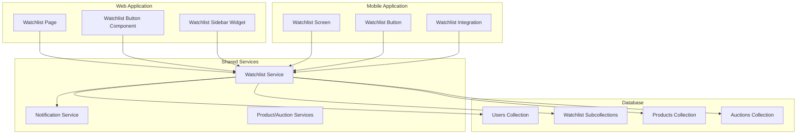
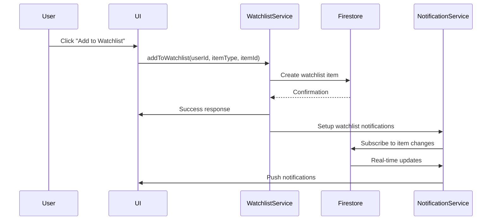

# Watchlist Feature Documentation

## Table of Contents

1. [Feature Overview](#feature-overview)
2. [Technical Architecture](#technical-architecture)
3. [API Documentation](#api-documentation)
4. [Database Schema](#database-schema)
5. [User Guide](#user-guide)
6. [Admin Guide](#admin-guide)
7. [Integration Points](#integration-points)
8. [Troubleshooting](#troubleshooting)
9. [Security Considerations](#security-considerations)
10. [Performance Optimization](#performance-optimization)

## Feature Overview

### Purpose

The Watchlist feature allows users to bookmark products and auctions they're interested in, creating a personalized watchlist for easy tracking and monitoring. This feature enhances user engagement by providing a convenient way to track items of interest across both web and mobile platforms.

### Key Features

- **Cross-Platform Synchronization**: Watchlist items sync automatically between web and mobile
- **Real-time Updates**: Users receive instant notifications when watched items change
- **Personal Notes**: Users can add notes to remember why they're interested in specific items
- **Bulk Management**: Select and manage multiple watchlist items at once
- **Notification Preferences**: Customize what types of updates trigger notifications

### Business Value

- **Increased User Engagement**: Users spend more time on the platform tracking their interests
- **Higher Conversion Rates**: Watchlisted items have higher purchase/participation rates
- **Personalized Experience**: Users feel more connected to the platform through their curated collections
- **Cross-Platform Consistency**: Seamless experience across web and mobile devices

## Technical Architecture

### Component Diagram



### Data Flow



### Service Implementation

The watchlist service is implemented in `shared/watchlistService.ts` with the following key functions:

```typescript
// Core watchlist operations
export async function addToWatchlist(
  userId: string,
  itemType: 'product' | 'auction',
  itemId: string,
  notes?: string
): Promise<{ success: boolean; error?: string; watchlistItemId?: string }>

export async function removeFromWatchlist(
  userId: string,
  itemId: string
): Promise<{ success: boolean; error?: string }>

export async function getUserWatchlist(
  userId: string
): Promise<{ success: boolean; error?: string; items?: WatchlistItem[] }>

export async function checkWatchlistStatus(
  userId: string,
  itemId: string
): Promise<{ success: boolean; error?: string; isInWatchlist?: boolean }>

export async function clearWatchlist(
  userId: string
): Promise<{ success: boolean; error?: string }>
```

## API Documentation

### Base Endpoints

All watchlist API endpoints are prefixed with `/api/watchlist/`

### Authentication

All endpoints require Firebase authentication with the Firebase ID token in the `Authorization` header.

### Endpoints

#### GET /api/watchlist/get

**Description**: Retrieve the current user's watchlist

**Parameters**: None

**Response**:
```json
{
  "success": true,
  "items": [
    {
      "id": "watchlist_item_id",
      "userId": "user_id",
      "itemType": "product|auction",
      "itemId": "item_id",
      "addedAt": "2023-12-01T10:30:00Z",
      "notes": "User notes about this item",
      "notificationPreferences": {
        "priceChanges": true,
        "auctionUpdates": true,
        "bidActivity": true
      }
    }
  ]
}
```

**Error Responses**:
- `401 Unauthorized`: User not authenticated
- `400 Bad Request`: Invalid request parameters
- `500 Internal Server Error`: Server-side error

#### POST /api/watchlist/add

**Description**: Add an item to the user's watchlist

**Request Body**:
```json
{
  "itemType": "product|auction",
  "itemId": "item_id",
  "notes": "Optional user notes"
}
```

**Response**:
```json
{
  "success": true,
  "watchlistItemId": "new_item_id"
}
```

**Error Responses**:
- `401 Unauthorized`: User not authenticated
- `400 Bad Request`: Invalid item type or missing parameters
- `409 Conflict`: Item already in watchlist
- `500 Internal Server Error`: Server-side error

#### POST /api/watchlist/remove

**Description**: Remove an item from the user's watchlist

**Request Body**:
```json
{
  "itemId": "item_id_to_remove"
}
```

**Response**:
```json
{
  "success": true
}
```

**Error Responses**:
- `401 Unauthorized`: User not authenticated
- `400 Bad Request`: Invalid item ID
- `404 Not Found`: Item not found in watchlist
- `500 Internal Server Error`: Server-side error

#### POST /api/watchlist/clear

**Description**: Clear the entire watchlist

**Request Body**: None

**Response**:
```json
{
  "success": true,
  "itemsRemoved": 42
}
```

**Error Responses**:
- `401 Unauthorized`: User not authenticated
- `500 Internal Server Error`: Server-side error

#### GET /api/watchlist/check

**Description**: Check if an item is in the user's watchlist

**Parameters**:
- `itemId`: The item ID to check

**Response**:
```json
{
  "success": true,
  "isInWatchlist": true,
  "watchlistItemId": "item_id_if_found"
}
```

**Error Responses**:
- `401 Unauthorized`: User not authenticated
- `400 Bad Request`: Missing itemId parameter
- `500 Internal Server Error`: Server-side error

## Database Schema

### Watchlist Item Structure

```typescript
interface WatchlistItem {
  id: string;                    // Auto-generated document ID
  userId: string;                // Owner of this watchlist item
  itemType: 'product' | 'auction'; // Type of item being watched
  itemId: string;                // Reference to the product or auction ID
  addedAt: Date;                 // When the item was added to watchlist
  notes?: string;                // User's personal notes about this item
  notificationPreferences?: {    // User's notification preferences
    priceChanges: boolean;       // Notify about price changes
    auctionUpdates: boolean;      // Notify about auction status changes
    bidActivity: boolean;         // Notify about new bids
  };
  lastNotified?: Date;           // Last time notification was sent
}
```

### Firestore Structure

```
users/
  {userId}/
    watchlist/
      {watchlistItemId}/
        - userId: string
        - itemType: string
        - itemId: string
        - addedAt: timestamp
        - notes: string (optional)
        - notificationPreferences: map (optional)
        - lastNotified: timestamp (optional)
```

### Security Rules

```javascript
// Firestore security rules for watchlist
match /users/{userId}/watchlist/{watchlistItemId} {
  allow read, write: if request.auth != null && request.auth.uid == userId;
  allow delete: if request.auth != null && request.auth.uid == userId;
}
```

## User Guide

### Accessing Your Watchlist

#### Web Platform
1. Log in to your eNumismatica.ro account
2. Click on "Lista mea de urmărire" in the main navigation
3. View all your watched products and auctions

#### Mobile Platform
1. Open the eNumismatica.ro mobile app
2. Tap the "Watchlist" icon in the bottom navigation
3. Browse your saved items

### Adding Items to Watchlist

#### From Product Pages
1. Navigate to any product detail page
2. Click the heart icon labeled "Adaugă la lista de urmărire"
3. Optional: Add personal notes about why you're interested
4. The item is now saved to your watchlist

#### From Auction Pages
1. Navigate to any auction detail page
2. Click the heart icon labeled "Adaugă la lista de urmărire"
3. Optional: Add personal notes about the auction
4. The auction is now saved to your watchlist

### Managing Your Watchlist

#### Viewing and Organizing
- Use the tabs to switch between "Produse" and "Licitații"
- See counts of each type in the tab labels
- Items are displayed in a grid layout with images and key information

#### Bulk Operations
1. Click the "Selectează" button to enter selection mode
2. Check the boxes on items you want to manage
3. Use the "Îndepărtează selectate" button to remove multiple items
4. Click "Anulează" to exit selection mode

#### Individual Item Management
- Click the heart icon on any item to remove it from watchlist
- Click the refresh button to manually update your watchlist
- Use the "Golește lista" button to clear all items (requires confirmation)

### Watchlist Features

#### Personal Notes
- Add notes when adding items or edit them later
- Notes help you remember why you're interested in specific items
- Notes are private and only visible to you

#### Notifications
- Get real-time notifications when watched items change
- Customize notification preferences for each item
- Receive alerts for price changes, auction updates, and bid activity

#### Cross-Platform Sync
- Your watchlist automatically syncs between web and mobile
- Changes made on one platform appear instantly on the other
- No manual sync required

## Admin Guide

### Monitoring Watchlist Usage

#### Accessing Watchlist Analytics
1. Log in with admin credentials
2. Navigate to Admin → Analytics
3. View watchlist usage statistics and trends

#### User Watchlist Management
- Admins can view but not modify user watchlists
- Watchlist data is private to each user
- Analytics show overall usage patterns without exposing individual data

### Troubleshooting User Issues

#### Common Watchlist Problems
- **Items not appearing**: Check user authentication and sync status
- **Sync issues**: Verify Firestore real-time listeners are working
- **Notification problems**: Check user notification preferences

#### Support Tools
- View user activity logs to see watchlist operations
- Check Firestore documents for watchlist data integrity
- Monitor real-time database connections

## Integration Points

### Cross-Platform Integration

#### Shared Service Usage
- Both web and mobile use the same `watchlistService.ts`
- Real-time updates via Firestore listeners
- Consistent data model across platforms

#### Platform-Specific Implementations
- **Web**: `web/app/watchlist/page.tsx` with responsive design
- **Mobile**: `mobile/screens/WatchlistScreen.tsx` with touch optimization

### Third-Party Integrations

#### Notification System
- Integrated with Firebase Cloud Messaging for push notifications
- Real-time updates via Firestore triggers
- Customizable notification preferences

#### Analytics Integration
- Watchlist usage tracked in activity logs
- Engagement metrics calculated from watchlist interactions
- Behavioral patterns analyzed from watchlist data

## Troubleshooting

### Common Issues and Solutions

#### Items Not Appearing in Watchlist
**Symptoms**: Added items don't show up in the watchlist
**Causes**:
- Network connectivity issues
- Authentication problems
- Firestore permission errors
- Client-side caching issues

**Solutions**:
1. Refresh the page or pull to refresh on mobile
2. Check internet connection
3. Log out and log back in
4. Clear browser cache or app data
5. Check Firestore security rules

#### Watchlist Not Syncing Between Devices
**Symptoms**: Changes on one device don't appear on another
**Causes**:
- Different user accounts logged in
- Network connectivity issues
- Firestore listener problems
- Device-specific caching

**Solutions**:
1. Verify same account is logged in on both devices
2. Check network connectivity on both devices
3. Manually refresh watchlist on both devices
4. Restart the app or clear cache
5. Check Firestore real-time database status

#### Watchlist Button Not Working
**Symptoms**: Clicking watchlist button has no effect
**Causes**:
- JavaScript errors
- Authentication expired
- API endpoint issues
- UI state management problems

**Solutions**:
1. Check browser console for errors
2. Refresh the page
3. Verify authentication status
4. Test API endpoints directly
5. Check service implementation for errors

### Debugging Tools

#### Browser Developer Tools
- Check network requests to watchlist API endpoints
- Monitor Firestore real-time updates in console
- Debug UI state management with React DevTools

#### Mobile Debugging
- Use Flipper or Android Studio for mobile debugging
- Check device logs for Firestore connection issues
- Monitor network requests with Charles Proxy

#### Server-Side Debugging
- Check Firestore logs for watchlist operations
- Monitor API endpoint performance
- Review security rule evaluations

## Security Considerations

### Data Privacy
- Watchlist data is private to each user
- Strict Firestore security rules prevent unauthorized access
- All watchlist operations require authentication

### Access Control
- Users can only access their own watchlist
- Admins can view aggregate statistics but not individual watchlists
- All API endpoints validate user authentication

### Input Validation
- Item IDs are validated before processing
- User notes are sanitized to prevent XSS
- All API parameters are type-checked

### Rate Limiting
- Watchlist operations are rate-limited
- Bulk operations have size limits
- Real-time listeners have connection limits

## Performance Optimization

### Client-Side Optimization
- **Caching**: Watchlist data cached locally for offline access
- **Pagination**: Large watchlists use pagination
- **Lazy Loading**: Items load progressively as user scrolls
- **Debouncing**: Watchlist updates debounced to reduce API calls

### Server-Side Optimization
- **Batch Operations**: Multiple watchlist changes processed in batches
- **Indexing**: Firestore indexes for efficient watchlist queries
- **Caching**: Server-side caching of frequently accessed watchlists
- **Connection Management**: Efficient Firestore listener management

### Network Optimization
- **Compression**: API responses compressed for faster delivery
- **Delta Updates**: Only changed data sent in real-time updates
- **Connection Reuse**: HTTP/2 connection reuse for multiple requests
- **Offline Queue**: Operations queued when offline and processed when online

### Monitoring and Maintenance
- **Performance Metrics**: Track watchlist operation latency
- **Error Rates**: Monitor failed watchlist operations
- **Usage Patterns**: Analyze watchlist feature adoption
- **Resource Usage**: Monitor Firestore read/write operations

## Conclusion

The Watchlist feature provides users with a powerful tool to track their favorite products and auctions across the eNumismatica.ro platform. With cross-platform synchronization, real-time updates, and personalized management capabilities, the watchlist enhances user engagement and provides a seamless experience between web and mobile platforms.

For additional support or technical questions about the watchlist implementation, please contact the development team at dev@enumismatica.ro.