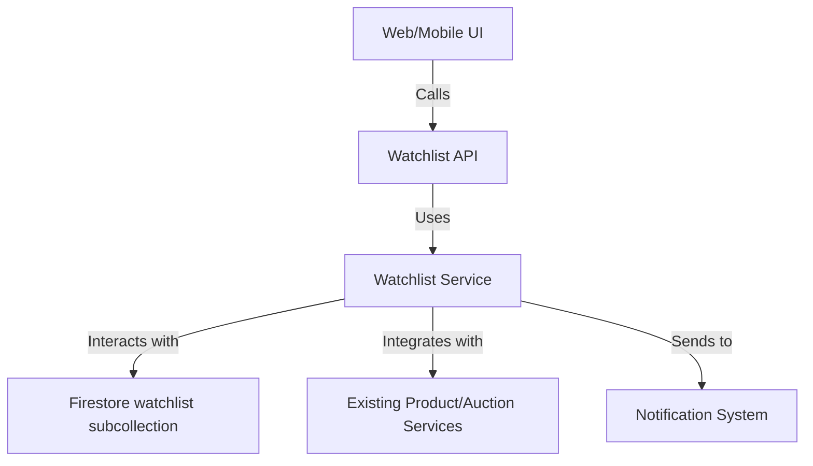

# Watchlist/Bookmarking System Implementation Plan

## Executive Summary

This document provides a comprehensive implementation plan for the Watchlist/Bookmarking System feature for the eNumismatica.ro platform. This feature will allow users to bookmark products and auctions they're interested in, creating a personalized watchlist for easy tracking and monitoring.

## Technical Requirements

### Database Schema Changes
- **New Watchlist Collection**: Create a `watchlist` subcollection under each user
- **Watchlist Item Interface**: Define the structure for watchlist items
- **Integration with Existing Collections**: Connect to products and auctions collections

### API Endpoints Required
- `POST /api/watchlist/add` - Add item to watchlist
- `POST /api/watchlist/remove` - Remove item from watchlist
- `GET /api/watchlist` - Get user's watchlist
- `GET /api/watchlist/check` - Check if item is in watchlist
- `POST /api/watchlist/clear` - Clear entire watchlist

### UI Component Requirements

#### Web Components
- **Watchlist Page**: `web/app/watchlist/page.tsx`
- **Watchlist Button Component**: Reusable component for product/auction cards
- **Watchlist Sidebar Widget**: Quick access to watchlist items
- **Watchlist Management**: Add/remove functionality on product/auction pages

#### Mobile Components
- **Watchlist Screen**: `mobile/screens/WatchlistScreen.tsx`
- **Watchlist Button**: Mobile-optimized button component
- **Watchlist Integration**: Integration with product/auction screens

### Integration Points
- **Existing Services**: Integrate with `shared/auctionService.ts` and product services
- **UI Integration**: Add watchlist buttons to product cards, auction cards, and detail pages
- **Data Sources**: Firestore `users/{userId}/watchlist` subcollection
- **Notification Integration**: Connect with existing notification system for watchlist alerts

## Database Schema Changes

```typescript
// New WatchlistItem interface
interface WatchlistItem {
  id: string;
  userId: string; // Owner of this watchlist item
  itemType: 'product' | 'auction'; // Type of item being watched
  itemId: string; // Reference to the product or auction ID
  addedAt: Date; // When the item was added to watchlist
  notes?: string; // User's personal notes about this item
  notificationPreferences?: {
    priceChanges: boolean;
    auctionUpdates: boolean;
    bidActivity: boolean;
  };
  lastNotified?: Date; // Last time notification was sent
}

// Extend User interface for watchlist tracking
interface UserWatchlist {
  watchlistCount: number;
  lastWatchlistUpdate: Date;
  watchlistNotificationPreferences: {
    enabled: boolean;
    frequency: 'immediate' | 'daily' | 'weekly';
  };
}
```

## API Endpoints Implementation

### Watchlist Service (`shared/watchlistService.ts`)
```typescript
// Core watchlist operations
export async function addToWatchlist(userId: string, itemType: 'product' | 'auction', itemId: string, notes?: string)
export async function removeFromWatchlist(userId: string, itemId: string)
export async function getUserWatchlist(userId: string)
export async function checkWatchlistStatus(userId: string, itemId: string)
export async function clearWatchlist(userId: string)
export async function updateWatchlistItemNotes(userId: string, itemId: string, notes: string)
```

## UI Component Implementation

### Web Components
1. **Watchlist Page** (`web/app/watchlist/page.tsx`)
   - Display all watched products and auctions
   - Filtering and sorting options
   - Bulk management actions
   - Real-time updates

2. **Watchlist Button** (`web/app/components/WatchlistButton.tsx`)
   - Reusable component for product/auction cards
   - Visual state (added/not added)
   - Animation feedback
   - Accessibility features

3. **Watchlist Sidebar** (`web/app/components/WatchlistSidebar.tsx`)
   - Quick access widget
   - Recent additions
   - Notification badges

### Mobile Components
1. **Watchlist Screen** (`mobile/screens/WatchlistScreen.tsx`)
   - Mobile-optimized watchlist display
   - Swipe actions for quick management
   - Offline caching support

2. **Watchlist Button** (`mobile/components/WatchlistButton.tsx`)
   - Touch-optimized design
   - Haptic feedback
   - Integration with mobile navigation

## Security Considerations

- **Data Privacy**: Ensure watchlist data is private to each user
- **Access Control**: Only allow users to access their own watchlist
- **Rate Limiting**: Prevent abuse of watchlist operations
- **Input Validation**: Sanitize all user-provided data (notes, etc.)
- **Firestore Security Rules**: Update rules to protect watchlist data

## Cross-Platform Compatibility

- **Consistent Data Model**: Same watchlist structure across platforms
- **Unified API**: Single API service for both web and mobile
- **Synchronized State**: Real-time sync between platforms
- **Platform-Specific UI**: Adapted to each platform's design patterns

## Error Handling Requirements

- **Comprehensive Error States**: Handle all possible failure scenarios
- **User Feedback**: Clear error messages and recovery options
- **Retry Logic**: Automatic retry for transient failures
- **Fallback UI**: Graceful degradation when features are unavailable

## Implementation Roadmap

### Phase 1: Foundation (Week 1)
- [ ] Database schema implementation
- [ ] Core service implementation
- [ ] Basic API endpoints
- [ ] Security rules and validation

### Phase 2: Web Integration (Week 2)
- [ ] Web UI components
- [ ] Integration with existing web pages
- [ ] Real-time updates and notifications
- [ ] Web-specific features

### Phase 3: Mobile Integration (Week 3)
- [ ] Mobile UI components
- [ ] Integration with existing mobile screens
- [ ] Offline support and caching
- [ ] Mobile-specific features

### Phase 4: Testing and Optimization (Week 4)
- [ ] Unit and integration tests
- [ ] Cross-platform testing
- [ ] Performance optimization
- [ ] User testing and feedback

## Success Metrics

### Quantitative Metrics
- **Adoption Rate**: Percentage of users utilizing watchlist feature
- **Engagement Increase**: Time spent on platform with watchlist enabled
- **Conversion Improvement**: Conversion rate for watched items
- **Feature Usage**: Frequency of watchlist operations

### Qualitative Metrics
- **User Satisfaction**: Feedback on watchlist usability
- **Platform Stickiness**: Reduction in user churn with watchlist feature
- **Discovery Improvement**: Increase in item discovery through watchlist
- **Purchase Confidence**: User confidence in purchase decisions

## Technical Architecture



## Security Architecture

```mermaid
graph TD
    A[User] -->|Authenticates| B[Firebase Auth]
    B -->|Authorizes| C[Watchlist Service]
    C -->|Validates| D[Firestore Security Rules]
    D -->|Accesses| E[User's watchlist subcollection]
    F[Watchlist Action] -->|Logged| G[Activity Log Service]